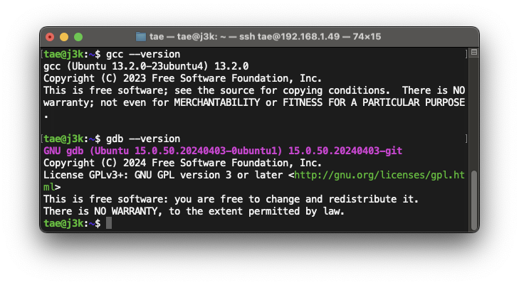

# Installing GCC and GDB on Linux

ให้เปิด Linux ของน้องขึ้นมาแต่ว่าในตัวอย่างของพี่พี่จะ Mac และ ssh เข้าไปในเครื่อง Ubuntu ของพี่


---

## Using the Package Manager

คำว่า `apt` หมายถึง Advanced Packaging Tool หรือเครื่องมือการจัดการแพคเกจขั้นสูงในระบบปฏิบัติการ Linux
ที่ใช้กันอย่างแพร่หลาย เช่น Ubuntu, Debian, Mint เป็นต้น
ซึ่งเป็นเครื่องมือสำหรับการจัดการและติดตั้งซอฟต์แวร์บนระบบปฏิบัติการ Linux โดยใช้หลักการของการจัดเก็บและจัดการแพคเกจ (
package management system) แบบ dpkg.

ในการลง GCC, GDB น้องสามารถใช้ `apt` ในการลงได้เลย

```bash
sudo apt-get update
sudo apt-get install build-essential gdb
```


**Verify installation:**

เมื่อทำการลงเสร็จแล้วให้ลองตรวจสอบการติดตั้งภายในเคร่ืองดู โดยสามารถรันคำสั่งได้ตามนี้

* **GCC:** `gcc --version`
* **GDB:** `gdb --version`



##  Compile and Debug

ให้น้องลองไปสร้างไฟล์ภาษา C ขึ้นมาและลองใช้ GCC คอมไพล์ดู

```bash
mkdir ~/phycom
cd ~/phycom
curl -o ~/phycom/hello.c "https://raw.githubusercontent.com/TaeTanakrit0089/PhysicalComputing-167/main/labs/labs03-gdb/files/hello.c"
```

คำสั่งด้านบนจะทำการดึงไฟล์ภาษา C ขื่อว่า `hello.c` ลงมาจาก GitHub ซึ่งข้างในจะมีโค้ดดังนี้

```c
#include "stdio.h"

int main() {
    printf("Hello World");
    
    printf("\n");
    return 0;
}
```

ให้น้องลองคอมไพล์ไฟล์และลองรันดู

```bash
gcc hello.c -o main.out
./main.out
```

ในการ Debugging ก็สามารถใช้ GDB ในการรัน Debugging ได้เลย

[Lab03: Debugging C Code with GDB on Windows (Cygwin)](readme.md)
