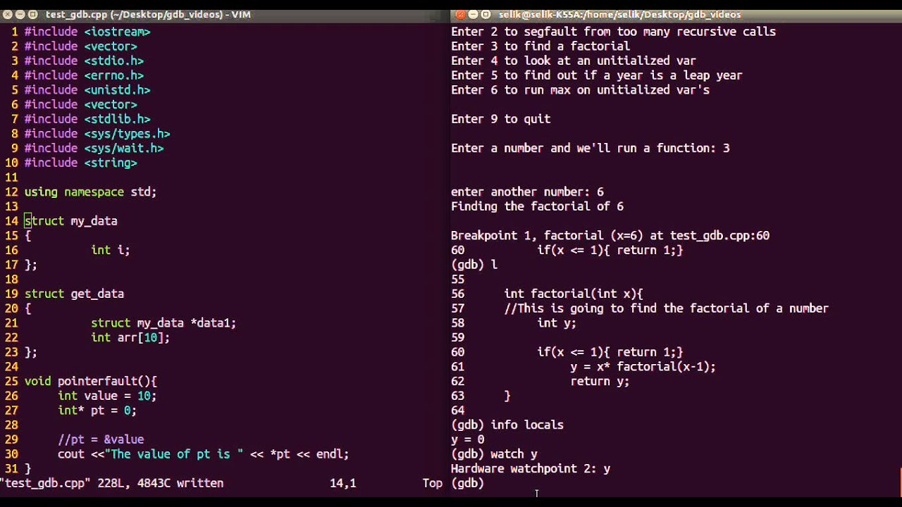
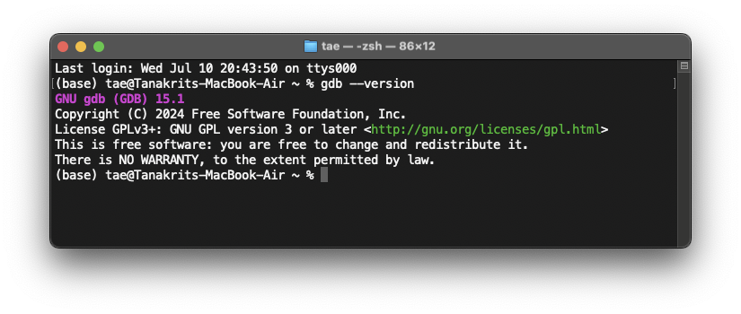

# Debugging C Code with GDB on Windows (Cygwin)

## What is GDB?

GDB (GNU Debugger) เป็นเครื่องมือสำหรับการดีบักโปรแกรม
ซึ่งช่วยให้ผู้พัฒนาสามารถตรวจสอบและแก้ไขข้อผิดพลาดในโค้ดโปรแกรมได้ โดย GDB สนับสนุนหลายภาษาโปรแกรม เช่น C, C++, และ
Fortran

คุณสมบัติหลักของ GDB มีดังนี้:

1. **การรันโปรแกรมทีละบรรทัด:** สามารถรันโปรแกรมทีละบรรทัดเพื่อดูการทำงานของแต่ละคำสั่งได้
2. **การตั้งเบรกพอยต์ (Breakpoint):** สามารถตั้งจุดหยุดชั่วคราวในโค้ด เพื่อดูค่าตัวแปรและการทำงานของโปรแกรมในจุดที่สนใจ
3. **การตรวจสอบและเปลี่ยนแปลงค่าตัวแปร:** สามารถตรวจสอบค่าตัวแปรในขณะรันโปรแกรมและเปลี่ยนแปลงค่าตัวแปรได้
4. **การเรียกดูสแตก (Stack):** สามารถเรียกดูสแตกเฟรมเพื่อวิเคราะห์การเรียกฟังก์ชันที่เกิดขึ้นก่อนหน้าการเกิดข้อผิดพลาด



## How to install GDB

### Verify GDB Installation

  * เปิด Cygwin Terminal
  * เช็คเวอร์ชันของ GDB เพื่อตรวจสอบว่า GDB ถูกลงในเครื่องแล้ว
     ```bash
     gdb --version
     ```

ถ้าใน Shell มีการติดตั้ง Cygwin อยู่แล้ว จะขึ้นผลลัพธ์ดังรูป ถ้าไม่ขึ้นแบบนี้ให้ติดตั้งก่อน



### Windows

สามารถใช้ Cygwin ในการรันได้เลยโดยจะต้องติดตั้ง Package ดังนี้ (https://www.cygwin.com/) หรือกลับไปอ่าน Document ของสัปดาห์ที่ 2 [วิธีการติดตั้ง Cygwin และ gcc บน Windows:](../labs02-gcc/readme.md#วิธีการติดตัง-cygwin-และ-gcc-บน-windows)

- `gcc-core`
- `gcc-g++`
- `libgcc1`
- `gdb`
- `libgdbm-devel`
- `libgdbm4`
- `libgdbm6`
- `libgdbm_compat4`

### MacOS

เนื่องจาก Apple ได้เปลี่ยนสถาปัตยกรรมของ CPU ใน Mac รุ่นใหม่จาก X86_64 ไปเป็นแบบ ARM ทำให้ไม่สามารถใช้ GDB ในการ
debugging ได้

ซึ่งผู้ใช้ Mac ARM นั้นสามารถใช้โปรแกรม `lldb` ในการ debugging
ซึ่งสามารถเช็คว่าได้ทำการติดตั้งลงเครื่องหรือยังผ่านคำสั่ง

```bash
lldb --version
```

ถ้าหากว่าในเครื่องได้มีโปรแกรมอยู่แล้ว จะขึ้นข้อความดังนี้

   ```
   lldb-1500.0.404.7
   Apple Swift version 5.10 (swiftlang-5.10.0.13 clang-1500.3.9.4)
   ```

## Starting Debugging with GDB

**1. Writing the Code**

- **คอมคณะ:** ใน Desktop ของเครื่องที่ห้องแลป 203 จะมีโฟลเดอร์ "PhysicalCom" ที่มีไฟล์โค้ดภาษา C ชื่อว่า `main.c`
  ถ้าไม่มีให้ทำตาม Private Computer (Windows)
- **Private Computer (Windows)**: สามารถก็อบคำสั่งด้านล่างไปใส่ใน cmd.exe ได้เลยหรือให้สร้างไฟล์ชื่อ `main.c`
  โดยข้างในไฟล์ต้องมีโค้ดเหมือนกับตัวอย่างด้านล่าง
  ```bash
  mkdir "%USERPROFILE%\Desktop\PhysicalCom"
  curl -o "%USERPROFILE%\Desktop\PhysicalCom\main.c" "https://raw.githubusercontent.com/TaeTanakrit0089/PhysicalComputing-167/main/labs/labs03-gdb/files/main.c"
  ```

- **Private Computer (MacOS)**: สามารถก็อบคำสั่งด้านล่างไปใส่ใน Terminal ได้เลย
  โดยที่คำสั่งนี้จะสร้างโฟลเดอร์ `PhysicalCom` ที่ Desktop และสร้างไฟล์ให้อัตโนมัติ
  ```bash
  mkdir -p ~/Desktop/PhysicalCom
  curl -o ~/Desktop/PhysicalCom/main.c "https://raw.githubusercontent.com/TaeTanakrit0089/PhysicalComputing-167/main/labs/labs03-gdb/files/main.c"
  ```

ให้ลองเปิดไฟล์ที่สร้างขึ้นมาใหม่ดู ข้างในไฟล์ต้องมีโค้ดดังนี้:

```c
#include "stdio.h"

int main() {
    int a = 10, b = 20, c = 30, d = 40;

    d = a++ + b++ + c++;
    d = ++a + ++b + ++c;

    return 0;
}
```

## Debugging C Code with GDB: A Step-by-Step Guide with `main.c` Example

ในส่วนนี้จะทำการสอนวิธีการ debugging ด้วย GDB ในโค้ดไฟล์ที่มีชื่อว่า `main.c`  โดยจะมีวิธีตรวจสอบค่าตัวแปร,
การแสดงผลลัพธ์, และการ breakpoint เพื่อเข้าใจกระบวนการทำงานของภาษา C

โค้ด `main.c` แสดงการใช้งานตัวดำเนินการเพิ่มค่า (`++`) ในภาษา C มันจะเริ่มต้นตัวแปร integer ทั้งหมด 4
ตัว (`a`, `b`, `c`, `d`)

**Steps:**

1. **Compile the Code:**

   ก่อนที่จะเริ่มการ debugging ให้ compile ไฟล์ `main.c` โดยใช้ GCC โดยต้องเติม option `-g`:

   ```bash
   gcc -g main.c -o main
   ```

    - The `-g` flag tells the compiler to generate debugging information.
    - The `-o <file>` flag tells the compiler to write output to <file>.


2. **Start the Debugger:**

   เมื่อ compile เสร็จแล้วจะได้ไฟล์ที่มีชื่อว่า `main` และในการรัน debugging สามารถรันได้โดยพิมพืคำสั่ง gdb
   ตามด้วยชื่อไฟล์:

   ```bash
   gdb main
   ```

3. **Set Breakpoints:**

   Breakpoints ตือขั้นตอนหนึ่งในโปรแกรมที่มีคำสั่งให้คอมพิวเตอร์พักการปฏิบัติการชั่วคราว (pause)

   ในการตั้งจุด breakpoints สามารถใช้คำสั่ง `break` ตามด้วย line number ของบรรทัดที่ต้องการจะหยุด:

   ```gdb
   (gdb) break 6
   ```

   จากคำสั่ด้านบนจะเป็นการสร้าง breakpoint ที่บรรทัดที่ 6


4. **Run the Program:**

   เริ่มการทำงานของโปรแกรมโดยใช้คำสั่ง `run`:

   ```gdb
   (gdb) run
   ```

   โปรแกรมจะทำงานไปจนกว่าถึงจุด breakpoint ที่ตั้งเอาไว้ เมื่อถึงจุด breakpoint (บรรทัดที่ 6)
   โปรแกรมจะหยุดการทำงานชั่วคราวและจะรอรับคำสั่งในการ debug จากเรา


5. **Check Variable Values:**

   ใช้คำสั่ง `print` ในการแสดงค่าของตัวแปรแต่ละตัว:

   ```gdb
   (gdb) print a
   (gdb) print b
   (gdb) print c
   (gdb) print d
   ```

   คำสั่งด้านบนจะแสดงผลลัพธ์ของค่าตัวแปร a, b, c และ d ผลลัพธ์จะขึ้นดังนี้

      ```gdb
      (int) 10
      (int) 20
      (int) 30
      (int) 40
      ```


6. **Step Through the Code:**

   Use the following commands to step through the code line by line:

    * `next`: Executes the current line and moves to the next.
    * `step`: Executes the current line and steps into any function calls.
    * `continue`: Continues execution until the next breakpoint or the program ends.

7. **Remove Breakpoints:**

   To remove a breakpoint, use the `delete` command followed by the breakpoint number:

   ```gdb
   (gdb) delete 1
   ```

8. **Quit the Debugger:**

Exit the debugger with the `quit` command:

```gdb
(gdb) quit
```

**Analyzing the `main.c` Code:**

By following these steps, you can analyze the execution flow of the `main.c` code and understand how the increment
operators affect the variable values. Pay attention to the values of `a`, `b`, `c`, and `d` at different stages of
execution.

]