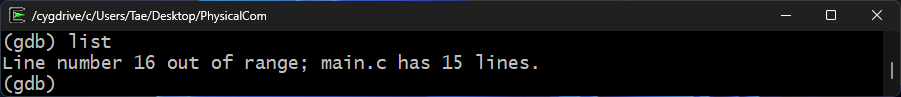
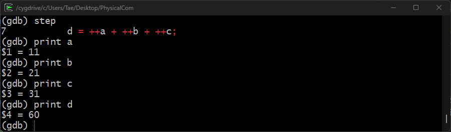

# Lab03: Debugging C Code with GDB on Windows (Cygwin)

Document นี้จะแนะนำการใช้งาน GDB (GNU Debugger) บน Windows ผ่าน Cygwin เพื่อค้นหาและแก้ไขข้อผิดพลาดในโค้ด C
เราจะมาเรียนรู้คำสั่งพื้นฐานและเทคนิคการ debug ผ่านตัวอย่างโค้ด main.c
โดยเน้นความเข้าใจง่าย เหมาะสำหรับน้องๆ ที่เริ่มต้นศึกษาการเขียนโปรแกรมภาษา C

## What is GDB?
GDB (GNU Debugger) เป็นเครื่องมือสำหรับการดีบักโปรแกรม
ซึ่งช่วยให้ผู้พัฒนาสามารถตรวจสอบและแก้ไขข้อผิดพลาดในโค้ดโปรแกรมได้ โดย GDB สนับสนุนหลายภาษาโปรแกรม เช่น C, C++, และ
Fortran


ลองนึกภาพว่าโค้ดของเราคือเขาวงกตที่ซับซ้อน GDB เปรียบเสมือนแผนที่และไฟฉายที่ช่วยให้เรามองเห็นเส้นทางการทำงานของโปรแกรมอย่างชัดเจน
เราสามารถหยุดโปรแกรมที่จุดต่างๆ ตรวจสอบค่าตัวแปร หรือแม้กระทั่งเปลี่ยนแปลงค่าระหว่างรันไทม์ได้
GDB ช่วยให้เรามองเห็นข้อผิดพลาดที่ซ่อนอยู่ได้อย่างรวดเร็วและแม่นยำ

คุณสมบัติหลักของ GDB มีดังนี้:

1. **การรันโปรแกรมทีละบรรทัด:** สามารถรันโปรแกรมทีละบรรทัดเพื่อดูการทำงานของแต่ละคำสั่งได้
2. **การตั้งเบรกพอยต์ (Breakpoint):** สามารถตั้งจุดหยุดชั่วคราวในโค้ด เพื่อดูค่าตัวแปรและการทำงานของโปรแกรมในจุดที่สนใจ
3. **การตรวจสอบและเปลี่ยนแปลงค่าตัวแปร:** สามารถตรวจสอบค่าตัวแปรในขณะรันโปรแกรมและเปลี่ยนแปลงค่าตัวแปรได้
4. **การเรียกดูสแตก (Stack):** สามารถเรียกดูสแตกเฟรมเพื่อวิเคราะห์การเรียกฟังก์ชันที่เกิดขึ้นก่อนหน้าการเกิดข้อผิดพลาด


## How to install GDB

### Verify GDB Installation

* เปิด Cygwin Terminal
* เช็คเวอร์ชันของ GDB เพื่อตรวจสอบว่า GDB ถูกลงในเครื่องแล้ว
   ```bash
   gdb --version
   ```

ถ้าใน Shell มีการติดตั้ง Cygwin อยู่แล้ว จะขึ้นผลลัพธ์ดังรูป ถ้าไม่ขึ้นแบบนี้ให้ติดตั้งก่อน


### Windows

สามารถใช้ Cygwin ในการรันได้เลยโดยจะต้องติดตั้ง Package ดังนี้ (https://www.cygwin.com/) หรือกลับไปอ่าน Document
ของสัปดาห์ที่
2 [วิธีการติดตั้ง Cygwin และ gcc บน Windows:](../labs02-gcc/readme.md#วิธีการติดตัง-cygwin-และ-gcc-บน-windows)

- `gcc-core`
- `gcc-g++`
- `libgcc1`
- `gdb`
- `libgdbm-devel`
- `libgdbm4`
- `libgdbm6`
- `libgdbm_compat4`

### MacOS

เนื่องจาก Apple ได้เปลี่ยนสถาปัตยกรรมของ CPU ใน Mac รุ่นใหม่จาก X86_64 ไปเป็นแบบ ARM ทำให้ไม่สามารถใช้ GDB ในการ
debugging ได้

ซึ่งผู้ใช้ Mac ARM นั้นสามารถใช้โปรแกรม `lldb` ในการ debugging
ซึ่งสามารถเช็คว่าได้ทำการติดตั้งลงเครื่องหรือยังผ่านคำสั่ง

```bash
lldb --version
```

ถ้าหากว่าในเครื่องได้มีโปรแกรมอยู่แล้ว จะขึ้นข้อความดังนี้

   ```
   lldb-1500.0.404.7
   Apple Swift version 5.10 (swiftlang-5.10.0.13 clang-1500.3.9.4)
   ```

## Starting Debugging with GDB

**1. Writing the Code**

- **คอมคณะ:** ใน Desktop ของเครื่องที่ห้องแลป 203 จะมีโฟลเดอร์ "PhysicalCom" ที่มีไฟล์โค้ดภาษา C ชื่อว่า `main.c`
  ถ้าไม่มีให้ทำตาม Private Computer (Windows)
- **Private Computer (Windows)**: สามารถก็อบคำสั่งด้านล่างไปใส่ใน cmd.exe ได้เลยหรือให้สร้างไฟล์ชื่อ `main.c`
  โดยข้างในไฟล์ต้องมีโค้ดเหมือนกับตัวอย่างด้านล่าง
  ```bash
  mkdir "%USERPROFILE%\Desktop\PhysicalCom"
  curl -o "%USERPROFILE%\Desktop\PhysicalCom\main.c" "https://raw.githubusercontent.com/TaeTanakrit0089/PhysicalComputing-167/main/labs/labs03-gdb/files/main.c"
  ```

- **Private Computer (MacOS)**: สามารถก็อบคำสั่งด้านล่างไปใส่ใน Terminal ได้เลย
  โดยที่คำสั่งนี้จะสร้างโฟลเดอร์ `PhysicalCom` ที่ Desktop และสร้างไฟล์ให้อัตโนมัติ
  ```bash
  mkdir -p ~/Desktop/PhysicalCom
  curl -o ~/Desktop/PhysicalCom/main.c "https://raw.githubusercontent.com/TaeTanakrit0089/PhysicalComputing-167/main/labs/labs03-gdb/files/main.c"
  ```

ให้ลองเปิดไฟล์ที่สร้างขึ้นมาใหม่ดู ข้างในไฟล์ต้องมีโค้ดดังนี้:

```c
#include "stdio.h"

int main() {
    int a = 10, b = 20, c = 30, d = 40;

    d = a++ + b++ + c++;
    d = ++a + ++b + ++c;

    printf("Hello, IT-KMITL");

    a = a++ + ++d;
    c = ++a + ++c;

    return 0;
}
```

## Debugging C Code with GDB: A Step-by-Step Guide with `main.c` Example

ในส่วนนี้จะทำการสอนวิธีการ debugging ด้วย GDB ในโค้ดไฟล์ที่มีชื่อว่า `main.c`  โดยจะมีวิธีตรวจสอบค่าตัวแปร,
การแสดงผลลัพธ์, และการ breakpoint เพื่อเข้าใจกระบวนการทำงานของภาษา C

โค้ด `main.c` แสดงการใช้งานตัวดำเนินการเพิ่มค่า (`++`) ในภาษา C มันจะเริ่มต้นตัวแปร integer ทั้งหมด 4
ตัว (`a`, `b`, `c`, `d`)

**Steps:**

1. **Compile the Code:**

   ก่อนที่จะเริ่มการ debugging ให้ compile ไฟล์ `main.c` โดยใช้ GCC โดยต้องเติม option `-g`:

   ```bash
   gcc -g main.c -o main
   ```

    - The `-g` flag tells the compiler to generate debugging information.
    - The `-o <file>` flag tells the compiler to write output to <file>.


2. **Start the Debugger:**

   เมื่อ compile เสร็จแล้วจะได้ไฟล์ที่มีชื่อว่า `main` และในการรัน debugging สามารถรันได้โดยพิมพืคำสั่ง gdb
   ตามด้วยชื่อไฟล์:

   ```bash
   gdb main
   ```
   เมื่อเรียกใช้ gdb จะพบหน้าต่างดังรูป โดยเราสามารถพิมพ์คำสั่งต่อจาก `(gdb)` ได้เลย

   

   เราสามารถใช้คำสั่ง list ในการแสดงโค้ดรอบๆ โดยการใช้งานคำสั่ง list สามารถใช้ได้ดังรูปแบบนี้

    - `list`: แสดงโค้ด 10 บรรทัด รอบๆ บรรทัดปัจจุบัน, หากใช้คำสั่ง `list` ซ้ำ GDB จะแสดงโค้ด 10 บรรทัดถัดไป
    - `list <line_number>`: แสดงโค้ด 10 บรรทัด รอบๆ บรรทัดที่ <line_number>
    - `list <function_name>`: แสดงโค้ดของฟังก์ชัน <function_name>
    - `list -`: แสดงโค้ด 10 บรรทัด ก่อนหน้ากลุ่มบรรทัดที่แสดงล่าสุด

   ให้น้องลองใช้ `list` แบบปกติดู
   ```gdb
   (gdb) list
   ```

   

   ในโค้ดตัวอย่าง main.c มีบรรทัดทั้งหมด 15 บรรทัด จะสังเกตได้ว่าในการรัน `list` ครั้งแรกจะแสดงโค้ดมาแค่ 10
   บรรทัดและในการรันครั้งที่สองจะแสดงโค้ดมาต่อจากส่วนถูกรันครั้งแรกไปแล้วจนถึงบรรทัดสุดท้าย และถ้าเรียก list
   อีกรอบจะเกิด
   error แบบนี้
   

   นั่นก็เพราะว่าเราได้เรียกคำสั่ง list
   ไปจนถึงคำสั่งสุดท้ายแล้วและเมื่อเรียกอีกมันก็ไม่สามารถเรียกได้เพราะว่าโค้ดได้สิ้นสุดแล้ว วิธีแก้เลยคือต้องเติม
   Argument
   ให้กับคำสั่ง `list <line_number>` โดยให้ใส่ <line_number> เป็นเลข 0 หมายความว่าให้เริ่ม list ตั้งแต่บรรทัดที่ 0 ใหม่
   ```gdb
   (gdb) list 0
   ```
   
   


3. **Set Breakpoints:**

   Breakpoints เป็นจุดที่เราสั่งให้โปรแกรมหยุดการทำงานชั่วคราว

   ในการตั้งจุด breakpoints ให้ใช้คำสั่ง `break` โดยมี Syntax ตามนี้

   ```gdb
   break <location>
   ```
   โดย `<location>` สามารถระบุเป็น:
    * **ชื่อฟังก์ชัน:** GDB จะหยุดการทำงานเมื่อโปรแกรมเรียกใช้ฟังก์ชันนั้น เช่น `break main`
    * **หมายเลขบรรทัด:** GDB จะหยุดการทำงานเมื่อโปรแกรมทำงานถึงบรรทัดนั้น เช่น `break 10`
    * **ที่อยู่หน่วยความจำ:** GDB จะหยุดการทำงานเมื่อมีการเข้าถึงที่อยู่หน่วยความจำนั้น
    * **เงื่อนไข:** GDB จะหยุดการทำงานเมื่อเงื่อนไขเป็นจริง เช่น `break main if i == 10`

   ให้น้องลองเขียนคำสั่งที่ใช้สำหรับสร้าง breakpoint ที่บรรทัดที่ 6 และ 11
   
   ```gdb
   (gdb) break 6
   (gdb) break 11
   ```
   เมื่อเราสร้าง breakpoint ขึ้นมาแล้ว เราสามารถเช็ค breakpoint ทั้งหมดได้จากการรันคำสั่ง `info breakpoints`
   คำสั่งนี้จะแสดงรายการของ breakpoint ทั้งหมดที่ตั้งค่าไว้ในโปรแกรมที่กำลัง debug อยู่ ข้อมูลที่แสดงจะประกอบไปด้วย:

   * **Breakpoint Number:** หมายเลขลำดับของ breakpoint
   * **Type:** ประเภทของ breakpoint (เช่น breakpoint ปกติ, watchpoint, catchpoint)
   * **Disposition:** สถานะหลังจาก breakpoint ถูกกระตุ้น (เช่น keep: เก็บ breakpoint ไว้, delete: ลบ breakpoint)
   * **Enabled:** สถานะของ breakpoint ว่าทำงานอยู่หรือไม่ (yes/no)
   * **Address:** ที่อยู่ของ breakpoint ในหน่วยความจำ
   * **What:** ข้อมูลระบุตำแหน่งของ breakpoint เช่น ชื่อไฟล์และหมายเลขบรรทัด

   ```gdb
   (gdb) info breakpoints
   ```
   

   ในการลบ Breakpoints สามารถใช้คำสั่ง `delete` ตามด้วยหมายเลขของ breakpoint

   ```gdb
   (gdb) delete 1
   ```

4. **Run the Program:**

   เริ่มการทำงานของโปรแกรมโดยใช้คำสั่ง `run`:

   ```gdb
   (gdb) run
   ```

   โปรแกรมจะทำงานไปจนกว่าถึงจุด breakpoint ที่ตั้งเอาไว้ เมื่อถึงจุด breakpoint (บรรทัดที่ 6)
   โปรแกรมจะหยุดการทำงานชั่วคราวและจะรอรับคำสั่งในการ debug จากเรา

   


5. **Check Variable Values:**

   ใช้คำสั่ง `print` ในการแสดงค่าของตัวแปรแต่ละตัว:

   ```gdb
   (gdb) print a
   (gdb) print b
   (gdb) print c
   (gdb) print d
   ```
   คำสั่งด้านบนจะแสดงผลลัพธ์ของค่าตัวแปร a, b, c และ d ผลลัพธ์จะขึ้นดังนี้

   

   นอกเหนือจากการปริ้นตัวแปรทีละตัว น้องๆ สามารถใข้คำสั่ง `info locals` ช่วยให้เรามองเห็นภาพรวมของตัวแปร local ทั้งหมดภายในขอบเขตของฟังก์ชันที่กำลังทำงานอยู่ได้อย่างรวดเร็ว

   

   ในการแสดงโค้ดรอบๆ บรรทัดปัจจุบันให้ใช้คำสั่ง `list`
   ```gdb
   (gdb) list
   ```
   


6. **Step Through the Code:**

   คำสั่งต่อไปนี้ใช้สำหรับการ Debug:

   * `next`
      - **การทำงาน:** สั่งให้โปรแกรมทำงานบรรทัดถัดไป โดย***ไม่***เข้าไปในฟังก์ชันที่ถูกเรียกใช้งาน
      - **ตัวอย่าง:** หากบรรทัดปัจจุบันมีการเรียกใช้ฟังก์ชัน `calculate()` คำสั่ง next
        จะทำงานจนจบฟังก์ชัน `calculate()` และหยุดที่บรรทัดถัดไปหลังจากนั้น
   * `step`
      - ดำเนินการโปรแกรมไปยังบรรทัดถัดไป โดย***เข้าไป***ภายในฟังก์ชันที่ถูกเรียกใช้
      - หากบรรทัดปัจจุบันมีการเรียกใช้ฟังก์ชัน `calculate()` จะหยุดที่บรรทัดแรกภายในฟังก์ชันนั้นๆ
   * `continue`
      - สั่งให้โปรแกรมทำงานต่อเนื่อง จนกว่าจะพบ breakpoint หรือสิ้นสุดการทำงาน

   | คำสั่ง | การทำงาน                                                     |  เหมาะสำหรับ                                      |
                                    |---|---|---|
   | `next` | ทำงานบรรทัดถัดไป ไม่เข้าฟังก์ชัน            | ข้ามฟังก์ชันที่มั่นใจว่าถูกต้อง                 |
   | `step` | ทำงานบรรทัดถัดไป เข้าไปในฟังก์ชัน      | ตรวจสอบการทำงานของฟังก์ชันอย่างละเอียด |
   | `continue` | ทำงานต่อเนื่องจนกว่าจะพบ breakpoint       | ผ่านโค้ดที่ไม่สนใจ, ไปยัง breakpoint ถัดไป |

   ให้พิมพ์คำสั่ง `step` เพื่อรันบรรทัดต่อไปและลองตรวจสอบค่าของตัวแปรดู
   จะสังเกตได้ว่าค่าของตัวแปรนั้นได้เปลี่ยนแปลงจากบรรทัดที่ 6 มาต่อที่บรรทัดที่ 7
   ```gdb
   (gdb) step
   (gdb) print a
   (gdb) print b
   (gdb) print c
   (gdb) print d
   ```
   

   พิมพ์คำสั่ง `continue` เพื่อให้โปรแกรมทำงานต่อ
   ```gdb
   (gdb) continue
   ```
   จะสังเกตได้ว่าโปรแกรมจะทำงานต่อมาจนถึงบรรทัดที่ 11 และได้หยุดการทำงานอีกรอบเพราะว่าเจอจุด breakpoint อีกตัว
   
   


7. **Watch the variable:**

   คำสั่ง `watch` ใน GDB เป็นเครื่องมือที่มีประโยชน์อย่างมากในการตรวจสอบการเปลี่ยนแปลงของค่าในตัวแปรระหว่างการ Debugging ต่างจากคำสั่ง print ที่แสดงค่าของตัวแปร ณ จุดที่รันคำสั่งเท่านั้น 

   `watch` จะคอยตรวจสอบนิพจน์ที่เรากำหนดไว้ตลอดเวลา และจะ**หยุดการทำงานของโปรแกรมทันทีที่ค่าของนิพจน์นั้นเปลี่ยนแปลง** มี Syntax ดังนี้

   ```gdb
   watch <expression>
   ```
   โดย `<expression>` คือ นิพจน์ที่เราต้องการเฝ้าดู เช่น:

   * **ตัวแปร:** `watch num_a`, `watch num_b`
   * **ค่าใน memory address:** `watch *(int*)0x12345678`
   * **ผลลัพธ์ของฟังก์ชัน:** `watch strlen(my_string)`

   จากตัวอย่างข้างบนที่น้องได้ทดลอง debugging มาและหยดที่บรรทัดที่ 11 ให้น้องลอง watch ตัวแปร `a` ดูโดยใช้คำสั่ง

   ```gdb
   (gdb) watch a
   ```
   

   เมื่อน้องรันคำสั่งนี้แล้ว มันจะสร้าง Watchpoint ขึ้นมาโดยสามารถเช็ค Watchpoint ทั้งหมดได้จากคำสั่ง
   ```gdb
   (gdb) info watchpoints
   ```
   

   การลบ Watchpoint ให้ใช้คำสั่ง `delete` ร่วมกับหมายเลขของ watchpoint ที่ต้องการลบ: `delete <watchpoint_number>`

   เมื่อน้องสร้าง Watchpoint เรียบร้อยแล้วให้ลอง `step` แล้วดูผลลัพธ์ดู จะสังเกตได้ว่าจะมีบรรทัดขึ้นมาใหม่ที่บอกค่าก่อนและหลังจากที่ได้ทำงานบรรทัดที่ 11

   

   ```gdb
   Old Value = 12
   New Value = 13
   ```
   
   จากการทำงานของคำสั่ง step ด้านบนคือเกิดการเปลี่ยบแแปลงของตัวแปร a ที่โค้ด `a++` (เรียกใช้ a ก่อนแล้วค่อยเพิ่มค่า +1) ทำให้โปรแกรมหยุดทำงานทันทีเมื่อค่าตัว a ได้ถูกเปลี่ยนแปลงซึ่งถ้าน้องรันคำสั่ง `step` อีกรอบนึง
   
   
   ```gdb
   Old Value = 13
   New Value = 79
   ```
   
   ค่าของ a จากเดิมที่เป็น 13 ได้กลายไปเป็น 79 เพราะว่าค่า a ได้ถูกเปลี่ยนแปลงอีกรอบที่โค้ดส่วน `a = a++ + ++d;` (a = 13 + 66) จึงทำให้โปรแกรมหยุดทำงาน
   
   อีกความเทพเลยก็คือ ปกติถ้าน้องรันคำสั่ง `continue` ไปแล้ว โปรแกรมก็จะทำงานไปเรื่อยๆ จนถุึงจุด Breakpoint อันต่อไปหรือถ้าไม่มีก็จะทำงานจนสิ้นสุดโปรแกรม แต่ถ้าน้องใส่ `watch` เข้าไปแล้ว คำสั่ง `continue` จะทำงานไปเรื่อยๆ จนกว่าค่าของตัวแปรที่น้องใส่จะถูกเปลี่ยนแปลง

   

   ให้น้องลองดูการเปลี่ยนแปลงของค่า a ไปเรื่อยๆ จนจบการทำงานของโปรแกรม เมื่อการทำงานสิ้นสุดลงแล้วจะขึ้นมาเป็นข้อความแบบนี้

   ```gdb
   (gdb) step
   Single stepping until exit from function cygwin_dll_init,
   which has no line number information.
   Hello, IT-KMITL[Thread 7020.0xae0 exited with code 0]
   [Thread 7020.0x1904 exited with code 0]
   [Thread 7020.0x12b8 exited with code 0]
   [Thread 7020.0x214 exited with code 0]
   [Inferior 1 (process 7020) exited normally]
   ```

8. **Quit from the Debugger:**

   พิมพ์คำสั่ง `quit` เพื่อออกจาก GDB
   ```gdb
   (gdb) quit
   ```