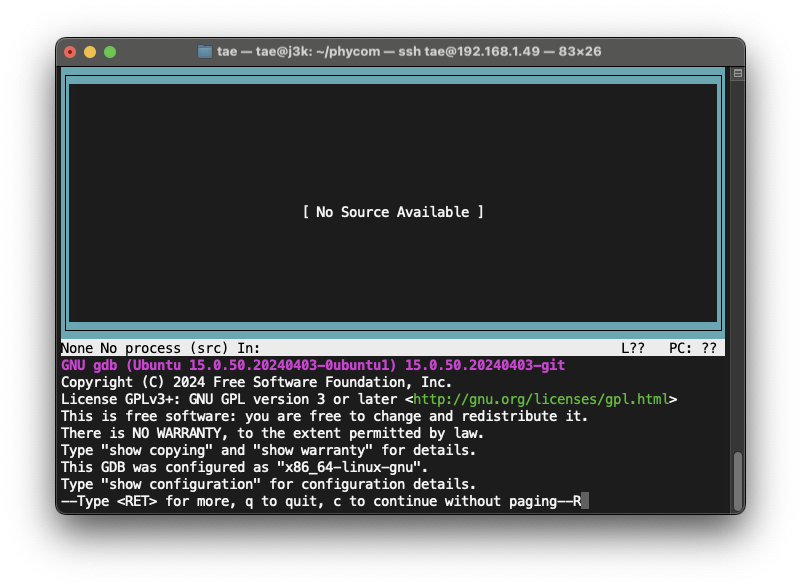
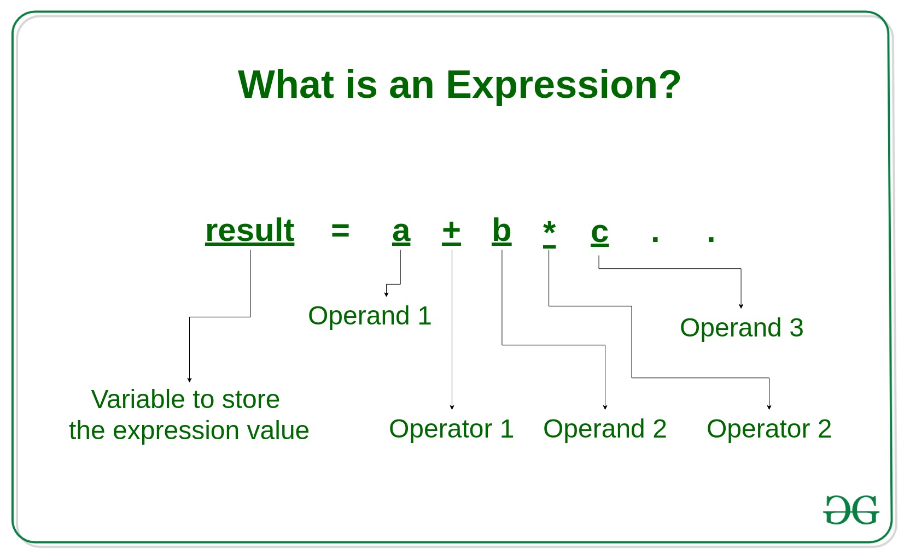

# Week04

### ปัญหาที่พบจากสัปดาห์ที่แล้ว

1. GDB ขึ้นว่า `Type for more, q to quit, c to continue without paging--R`
    * **Enter:** ดูข้อความต่อ
    * **q:** ออกจาก GDB
    * **c:** ดำเนินการต่อโดยไม่แสดงข้อความ

## สรุปการ Debug C Code ด้วย GDB:

### หัวใจสำคัญในการทำ Debugging

- เริ่มต้นด้วยการ compile โค้ดพร้อมข้อมูล debugging.
- ตั้ง breakpoint ที่ตำแหน่งที่ต้องการตรวจสอบ.
- ใช้คำสั่ง `next`, `step` หรือ `continue` ในการ debug โค้ด.
- ตรวจสอบค่าของตัวแปรด้วย `print` หรือ `info locals`.
- ใช้ `watch` เพื่อเฝ้าดูการเปลี่ยนแปลงค่าของตัวแปร.

### Step และคำสั่งการทำ Debugging

1. **การ Compile โค้ด:**
    - ใช้ `gcc -g main.c -o main` เพื่อ Compile โค้ดพร้อมสร้างข้อมูล debugging
2. **การเรียกใช้ GDB:**
    - ใช้ `gdb main` เพื่อเรียกใช้ debugger
3. **การแสดงโค้ด (list):**
    - `list`: แสดง 10 บรรทัดรอบๆ บรรทัดปัจจุบัน
    - `list <line_number>`: แสดง 10 บรรทัดรอบๆ บรรทัดที่ <line_number>
    - `list <function_name>`: แสดงโค้ดของฟังก์ชัน <function_name>
    - `list -`: แสดง 10 บรรทัดก่อนหน้ากลุ่มบรรทัดที่แสดงล่าสุด
4. **การสร้าง Breakpoint:**
    - `break <location>`: สร้าง breakpoint ที่ตำแหน่งที่ระบุ
    - `<location>` สามารถเป็น:
        - ชื่อฟังก์ชัน: เช่น `break main`
        - หมายเลขบรรทัด: เช่น `break 10`
        - ที่อยู่หน่วยความจำ
        - เงื่อนไข: เช่น `break main if i == 10`
    - `info breakpoints`: แสดงรายการ breakpoints ทั้งหมด
    - `delete <num>`: ลบ breakpoint
5. **การเรียกใช้โปรแกรม:**
    - `run`: เรียกใช้โปรแกรม
    - โปรแกรมจะหยุดทำงานที่ breakpoint
6. **การตรวจสอบค่าตัวแปร:**
    - `print <variable>`: แสดงค่าตัวแปร
    - `info locals`: แสดงค่าของตัวแปร local ทั้งหมด
7. **การ Debug โค้ด:**
    - `next`: ทำงานบรรทัดถัดไป (ไม่เข้าไปในฟังก์ชัน)
    - `step`: ทำงานบรรทัดถัดไป (เข้าไปในฟังก์ชัน)
    - `continue`: ทำงานต่อเนื่องจนกว่าจะพบ breakpoint หรือสิ้นสุดการทำงาน
    - `finish`: ทำงานต่อจนจบฟังก์ชันปัจจุบัน
8. **การเฝ้าดูตัวแปร:**
    - `watch <expression>`: เฝ้าดูค่าของนิพจน์
    - `info watchpoints`: แสดงรายการ watchpoints
    - `delete <watchpoint_number>`: ลบ watchpoint
9. **การออกจาก GDB:**
    - `quit`: ออกจาก debugger

**GDB Text User Interface:**

- `gdb --tui <file_name>`: เปิดใช้งาน UI แบบกราฟิกของ GDB

**ข้อดีของการ debug ด้วย GDB:**

- ช่วยในการเข้าใจการทำงานของโปรแกรมอย่างละเอียด.
- ช่วยในการแก้ไขข้อผิดพลาดในโปรแกรมได้ง่ายขึ้น.
- ช่วยในการตรวจสอบค่าของตัวแปรในขณะที่โปรแกรมกำลังทำงาน.

**คำแนะนำ:**

---

## Debugging Expression

**นิพจน์ (Expression)** ในโปรแกรม ซึ่งนิพจน์คือการรวมกันของ ตัวดำเนินการ (Operators), ค่าคงที่ (Constants), และตัวแปร (
Variables) เพื่อสร้างค่าผลลัพธ์

### ตัวอย่างนิพจน์:

* a+b
* c
* s-1/7*f

  

### ประเภทของนิพจน์

บทความอธิบายถึงประเภทของนิพจน์ ดังนี้

* **นิพจน์คงที่ (Constant Expressions)**: ประกอบด้วยค่าคงที่เท่านั้น (ค่าที่ไม่เปลี่ยนแปลง) เช่น `5`, `10+5/6.0`
* **นิพจน์จำนวนเต็ม (Integral Expressions)**:  สร้างผลลัพธ์เป็นจำนวนเต็มหลังจากการแปลงข้อมูลโดยอัตโนมัติหรือโดยชัดแจ้ง
  เช่น `x`, `x*y`, `x+5.00`
* **นิพจน์ทศนิยม (Floating Expressions)**: สร้างผลลัพธ์เป็นทศนิยมหลังจากการแปลงข้อมูลโดยอัตโนมัติหรือโดยชัดแจ้ง เช่น
  `x+y`, `10.75`

  
* **นิพจน์เชิงสัมพันธ์ (Relational Expressions)**: ผลลัพธ์เป็นค่าตรรกะ (Boolean) ซึ่งมีค่าเป็นจริงหรือเท็จ
  เกิดจากการเปรียบเทียบค่าสองค่า เช่น `x<=y`, `x+y>2`
* **นิพจน์เชิงตรรกะ (Logical Expressions)**:  รวมนิพจน์เชิงสัมพันธ์ 2 ค่าขึ้นไป และผลลัพธ์เป็นค่าตรรกะ (Boolean) เช่น `x>
  y && x==10`, `x==10 || y==5`

* **นิพจน์ตัวชี้ (Pointer Expressions)**: สร้างค่าเป็นที่อยู่ เช่น `&x`, `ptr`, `ptr++`
* **นิพจน์บิต (Bitwise Expressions)**: ใช้สำหรับการจัดการข้อมูลที่ระดับบิต เช่น `x<<3` (เลื่อนบิต 3 ตำแหน่งไปทางซ้าย),` y>>
  1` (เลื่อนบิต 1 ตำแหน่งไปทางขวา)
* **นิพจน์แบบผสม (Compound Expressions)**:  การรวมกันของนิพจน์ประเภทต่างๆ

**หมายเหตุ:**

* นิพจน์สามารถใช้ร่วมกันได้ เช่น a+b*c เป็นนิพจน์แบบผสม (Compound Expressions)
* นิพจน์แบบผสมมักมีลำดับการดำเนินการ (Operator Precedence) เช่น PEMDAS การคูณและการหารมีลำดับการดำเนินการสูงกว่าการบวกและการลบ

## Reference

- [What is an Expression and What are the types of Expressions?](https://www.geeksforgeeks.org/what-is-an-expression-and-what-are-the-types-of-expressions/)