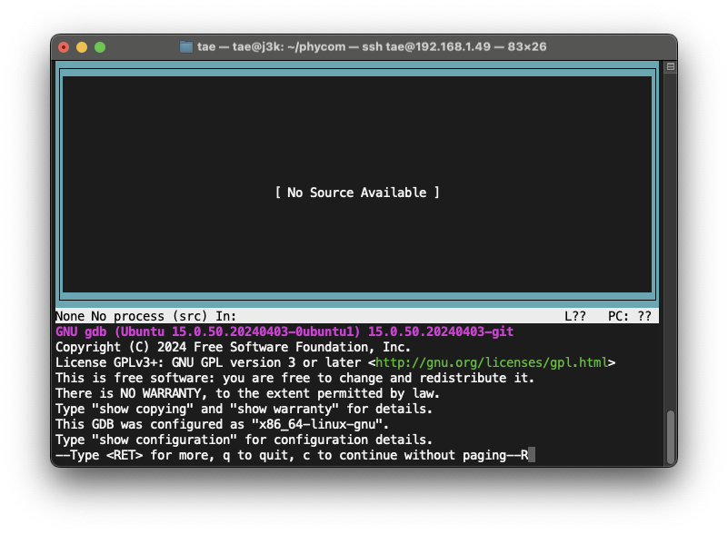

# Week04

### ปัญหาที่พบจากสัปดาห์ที่แล้ว

1. GDB ขึ้นว่า `Type for more, q to quit, c to continue without paging--R`
    * **Enter:** ดูข้อความต่อ
    * **q:** ออกจาก GDB
    * **c:** ดำเนินการต่อโดยไม่แสดงข้อความ



## สรุปการ Debug C Code ด้วย GDB:

### หัวใจสำคัญในการทำ Debugging

- เริ่มต้นด้วยการ compile โค้ดพร้อมข้อมูล debugging.
- ตั้ง breakpoint ที่ตำแหน่งที่ต้องการตรวจสอบ.
- ใช้คำสั่ง `next`, `step` หรือ `continue` ในการ debug โค้ด.
- ตรวจสอบค่าของตัวแปรด้วย `print` หรือ `info locals`.
- ใช้ `watch` เพื่อเฝ้าดูการเปลี่ยนแปลงค่าของตัวแปร.

### Step และคำสั่งการทำ Debugging

1. **การ Compile โค้ด:**
    - ใช้ `gcc -g main.c -o main` เพื่อ Compile โค้ดพร้อมสร้างข้อมูล debugging
2. **การเรียกใช้ GDB:**
    - ใช้ `gdb main` เพื่อเรียกใช้ debugger
3. **การแสดงโค้ด (list):**
    - `list`: แสดง 10 บรรทัดรอบๆ บรรทัดปัจจุบัน
    - `list <line_number>`: แสดง 10 บรรทัดรอบๆ บรรทัดที่ <line_number>
    - `list <function_name>`: แสดงโค้ดของฟังก์ชัน <function_name>
    - `list -`: แสดง 10 บรรทัดก่อนหน้ากลุ่มบรรทัดที่แสดงล่าสุด
4. **การสร้าง Breakpoint:**
    - `break <location>`: สร้าง breakpoint ที่ตำแหน่งที่ระบุ
    - `<location>` สามารถเป็น:
        - ชื่อฟังก์ชัน: เช่น `break main`
        - หมายเลขบรรทัด: เช่น `break 10`
        - ที่อยู่หน่วยความจำ
        - เงื่อนไข: เช่น `break main if i == 10`
    - `info breakpoints`: แสดงรายการ breakpoints ทั้งหมด
    - `delete <num>`: ลบ breakpoint
5. **การเรียกใช้โปรแกรม:**
    - `run`: เรียกใช้โปรแกรม
    - โปรแกรมจะหยุดทำงานที่ breakpoint
6. **การตรวจสอบค่าตัวแปร:**
    - `print <variable>`: แสดงค่าตัวแปร
    - `info locals`: แสดงค่าของตัวแปร local ทั้งหมด
7. **การ Debug โค้ด:**
    - `next`: ทำงานบรรทัดถัดไป (ไม่เข้าไปในฟังก์ชัน)
    - `step`: ทำงานบรรทัดถัดไป (เข้าไปในฟังก์ชัน)
    - `continue`: ทำงานต่อเนื่องจนกว่าจะพบ breakpoint หรือสิ้นสุดการทำงาน
    - `finish`: ทำงานต่อจนจบฟังก์ชันปัจจุบัน
8. **การเฝ้าดูตัวแปร:**
    - `watch <expression>`: เฝ้าดูค่าของนิพจน์
    - `info watchpoints`: แสดงรายการ watchpoints
    - `delete <watchpoint_number>`: ลบ watchpoint
9. **การออกจาก GDB:**
    - `quit`: ออกจาก debugger

**GDB Text User Interface:**

- `gdb --tui <file_name>`: เปิดใช้งาน UI แบบกราฟิกของ GDB

---

## Debugging Expression

**นิพจน์ (Expression)** ในโปรแกรม ซึ่งนิพจน์คือการรวมกันของ ตัวดำเนินการ (Operators), ค่าคงที่ (Constants), และตัวแปร (
Variables) เพื่อสร้างค่าผลลัพธ์

### ตัวอย่างนิพจน์:

* a+b
* c
* s-1/7*f


### ประเภทของนิพจน์

บทความอธิบายถึงประเภทของนิพจน์ ดังนี้

* **นิพจน์คงที่ (Constant Expressions)**: ประกอบด้วยค่าคงที่เท่านั้น (ค่าที่ไม่เปลี่ยนแปลง) เช่น `5`, `10+5/6.0`
* **นิพจน์จำนวนเต็ม (Integral Expressions)**:  สร้างผลลัพธ์เป็นจำนวนเต็มหลังจากการแปลงข้อมูลโดยอัตโนมัติหรือโดยชัดแจ้ง
  เช่น `x`, `x*y`, `x+5.00`
* **นิพจน์ทศนิยม (Floating Expressions)**: สร้างผลลัพธ์เป็นทศนิยมหลังจากการแปลงข้อมูลโดยอัตโนมัติหรือโดยชัดแจ้ง เช่น
  `x+y`, `10.75`


* **นิพจน์เชิงสัมพันธ์ (Relational Expressions)**: ผลลัพธ์เป็นค่าตรรกะ (Boolean) ซึ่งมีค่าเป็นจริงหรือเท็จ
  เกิดจากการเปรียบเทียบค่าสองค่า เช่น `x<=y`, `x+y>2`
* **นิพจน์เชิงตรรกะ (Logical Expressions)**:  รวมนิพจน์เชิงสัมพันธ์ 2 ค่าขึ้นไป และผลลัพธ์เป็นค่าตรรกะ (Boolean)
  เช่น `x>
  y && x==10`, `x==10 || y==5`


* **นิพจน์ตัวชี้ (Pointer Expressions)**: สร้างค่าเป็นที่อยู่ เช่น `&x`, `ptr`, `ptr++`
* **นิพจน์บิต (Bitwise Expressions)**: ใช้สำหรับการจัดการข้อมูลที่ระดับบิต เช่น `x<<3` (เลื่อนบิต 3
  ตำแหน่งไปทางซ้าย),` y>>
  1` (เลื่อนบิต 1 ตำแหน่งไปทางขวา)
* **นิพจน์แบบผสม (Compound Expressions)**:  การรวมกันของนิพจน์ประเภทต่างๆ

**หมายเหตุ:**

* นิพจน์สามารถใช้ร่วมกันได้ เช่น a+b*c เป็นนิพจน์แบบผสม (Compound Expressions)
* นิพจน์แบบผสมมักมีลำดับการดำเนินการ (Operator Precedence) เช่น PEMDAS
  การคูณและการหารมีลำดับการดำเนินการสูงกว่าการบวกและการลบ

### Using Expressions with GDB

1. **Basic GDB Commands:** น้องๆ สามารถใช้คำสั่งย่อใน GDB ได้

    - **Starting and Controlling Execution:**

        * **`r`, `run`**: Start the program.
        * **`c`, `continue`**: Continue execution.
        * **`n`, `next`**: Execute the next line.
        * **`s`, `step`**: Step into the next line including function calls.

    - **Setting Breakpoints:**

        * **`b <function>`**: Breakpoint at the specified function.
        * **`b <line>`**: Breakpoint at the specified line number.

    - **Inspecting and Printing:**

        * **`p <expression>`, `print`**: Print the value of an expression.
        * **`l`, `list`**: List source code around the current line.

    - **Exiting GDB:**

        * **`q`, `quit`**: Quit GDB.

2. **Expressions in GDB**

   น้องสามารถใช้ Expression ใน GDB เพื่อใช้ร่วมกับ operators, variables, and functions ได้

    * **Basic arithmetic operators:** `+`, `-`, `*`, `/`, `%`.
    * **Comparison operators:** `==`, `!=`, `<`, `>`, `<=`, `>=`.
    * **Logical operators:** `&&` (AND), `||` (OR), `!` (NOT).
    * **Bitwise operators:** `&` (AND), `|` (OR), `^` (XOR), `~` (NOT).
    * **Variable access:** Use the variable name directly, e.g., `x`, `my_array[3]`.
    * **Function calls:** `function_name(arguments)`.

   **ตัวอย่าง:**

   ```
   (gdb) p (d <= 'a') && ('A' >= c - 30)
   ```

   นิพจน์นี้จะตรวจสอบว่าตัวแปร `d` น้อยกว่าหรือเท่ากับค่า ASCII ของ `a` หรือไม่ และค่า ASCII ของ `A`
   มากกว่าหรือเท่ากับค่า `c` ลบ 30 หรือไม่

## Debugging C Code with GDB Expression: A Step-by-Step Guide with `expression.c` Example

ในส่วนนี้จะทำการสอนวิธีการ debugging ด้วย GDB ในโค้ดไฟล์ที่มีชื่อว่า `expression.c`  โดยจะมีวิธีตรวจสอบค่าตัวแปร,
การแสดงผลลัพธ์, และการ breakpoint เพื่อเข้าใจกระบวนการทำงานของภาษา C

โค้ด `main.c` แสดงการใช้งานตัวดำเนินการเพิ่มค่า (`++`) ในภาษา C มันจะสร้างตัวแปร integer ทั้งหมด 4
ตัว (`a`, `b`, `c`, `d`)
---
**Steps:**

**1. Writing the Code**

- **คอมคณะ:** ใน Desktop ของเครื่องที่ห้องแลป 203 จะมีโฟลเดอร์ "PhysicalCom" ที่มีไฟล์โค้ดภาษา C ชื่อว่า `expression.c`
  ถ้าไม่มีให้ทำตาม Private Computer (Windows)
- **Private Computer (Windows)**: สามารถก็อบคำสั่งด้านล่างไปใส่ใน cmd.exe ได้เลยหรือให้สร้างไฟล์ชื่อ `expression.c`
  โดยข้างในไฟล์ต้องมีโค้ดเหมือนกับตัวอย่างด้านล่าง
  ```bash
  mkdir "%USERPROFILE%\Desktop\PhysicalCom"
  curl -o "%USERPROFILE%\Desktop\PhysicalCom\main.c" "https://raw.githubusercontent.com/TaeTanakrit0089/PhysicalComputing-167/main/labs/labs04-gdb02/files/expression.c"
  ```

- **Private Computer (MacOS)**: สามารถก็อบคำสั่งด้านล่างไปใส่ใน Terminal ได้เลย
  โดยที่คำสั่งนี้จะสร้างโฟลเดอร์ `PhysicalCom` ที่ Desktop และสร้างไฟล์ให้อัตโนมัติ
  ```bash
  mkdir -p ~/Desktop/PhysicalCom
  curl -o ~/Desktop/PhysicalCom/main.c "https://raw.githubusercontent.com/TaeTanakrit0089/PhysicalComputing-167/main/labs/labs04-gdb02/files/expression.c"
  ```

ให้ลองเปิดไฟล์ที่สร้างขึ้นมาใหม่ดู ข้างในไฟล์ต้องมีโค้ดดังนี้:

```c
#include "stdio.h"

int main() {
    int i=10, j=20;
    float x=0.001, y=0.00, z=81.753;
    char c='a', d='G';

    (d <= 'a') && ('A' >= c-30);
    z/j;
    c=i+=j;

    return 0;
}
```

---

2. **Compile the Code:**

   ก่อนที่จะเริ่มการ debugging ให้ compile ไฟล์ `expression.c` โดยใช้ GCC **โดยต้องเติม option `-g`**:
   ```bash
   gcc -g expression.c -o expression
   ```

    - The `-g` flag tells the compiler to generate debugging information.
    - The `-o <file>` flag tells the compiler to write output to <file>.

---

3. **Start the Debugger:**

   เมื่อ compile เสร็จแล้วจะได้ไฟล์ที่มีชื่อว่า `main` และในการรัน debugging สามารถรันได้โดยพิมพ์คำสั่ง `gdb`
   ตามด้วยชื่อไฟล์:

   ```bash
   gdb expression
   ```
   เมื่อเรียกใช้ gdb จะพบหน้าต่างดังรูป โดยเราสามารถพิมพ์คำสั่งต่อจาก `(gdb)` ได้เลย

---

4. **Set Breakpoints:**

   ในรอบนี้ให้น้องลองตั้ง breakpoint ไว้ที่บรรทัดที่ 8 ซึ่งจะตรงกับโค้ดส่วนนี้ `(d <= 'a') && ('A' >= c-30)`
   ```gdb
   (gdb) b 8
   ```

---

5. **Run the Program:**

   เริ่มการทำงานของโปรแกรมโดยใช้คำสั่ง `run`:

   ```gdb
   (gdb) r
   ```

   โปรแกรมจะทำงานไปจนกว่าถึงจุด breakpoint ที่ตั้งเอาไว้ เมื่อถึงจุด breakpoint (บรรทัดที่ 8)
   โปรแกรมจะหยุดการทำงานชั่วคราวและจะรอรับคำสั่งในการ debug จากเรา

   เมื่อถึงโปรแกรมหยุดที่บรรทัดที่ 8 แล้วลองให้น้องปริ้นโค้ดบริเวณนั้นๆ ออกมาดู
   ```gdb
   (gdb) l
   ```

---

6. **Check The Expression Values:**

   `(d <= 'a') && ('A' >= c-30)` This is an expression, not an assignment!!!
   ถ้าเราต้องการจะดูผลลัพธ์จาก expression เราสามารถใช้คำสั่ง `print` ตามด้วย expression
   ไปได้เลย ([Using Expressions with GDB](#using-expressions-with-gdb))

   ```gdb
   (gdb) p (d <= 'a') && ('A' >= c-30)
   ```
   คำสั่งจะรันนิพจน์ทั้งหมดและพิมพ์ผลลัพธ์ ซึ่ง expression ข้างบนเป็น Logical Expressions ผลลัพธ์จะออกมาเป็น Boolean ค่า
   True และ False
    - 1 คือ True
    - 0 คือ False

---

7. **Step Through the Code:**

   ให้น้องรันคำสั่ง `next` เพื่อรันบรรทัดต่อไป
   ```gdb
   (gdb) n
   ```

   ในบรรทัดนี้จะมี expression `z/j` ถ้าน้องต้องการเช็คผลลัพธ์ก็สามารถใช้คำสั่ง `print` ตามด้วย expression ได้เลย
   ```gdb
   (gdb) p z/j
   ```
   ซึ่งผลลัพธ์ของค่า `z/j` ก็จะออกมา

---

8. **Quit from the Debugger:**

   พิมพ์คำสั่ง `quit` เพื่อออกจาก GDB
   ```gdb
   (gdb) quit
   ```

---

## Reference

- [What is an Expression and What are the types of Expressions?](https://www.geeksforgeeks.org/what-is-an-expression-and-what-are-the-types-of-expressions/)