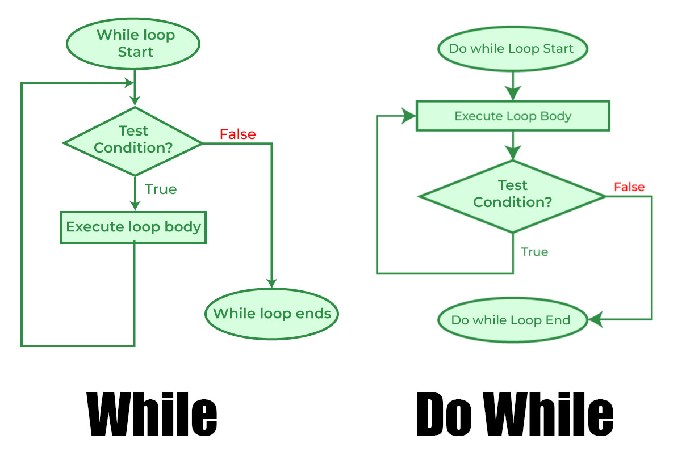
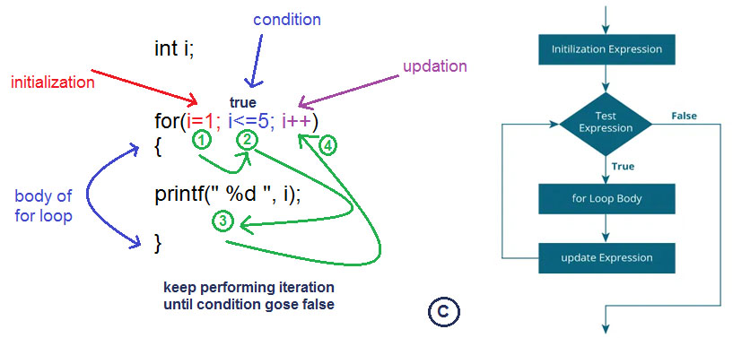

# Lab05: โครงสร้างแบบวนซ้ำ (Loop Structure)

## Contexts

* **การควบคุมลูป (Loop Control)**
    * การควบคุมแบบนับจำนวน (Counter Control)
    * การควบคุมแบบเหตุการณ์ (Event Control)
* **คำสั่งวนซ้ำในภาษา C**
    * `while`
    * `do... while`
    * `for`

## แนวคิดของการวนซ้ำ (The Concept of Loop)

ลูป คือ กลไกที่ทำให้โปรแกรมทำงานชุดคำสั่งเดิมซ้ำๆ กันหลายรอบ
โดยมีเงื่อนไขในการควบคุมการทำงานว่าจะวนซ้ำเมื่อไหร่และจะหยุดการวนซ้ำเมื่อไหร่

### ส่วนประกอบของลูป

* **ตัวแปรควบคุมลูป (Loop Control Variable)**: ตัวแปรที่ใช้ติดตามสถานะของลูป
  เช่น จำนวนรอบที่วนซ้ำ หรือค่าที่เปลี่ยนแปลงไปในแต่ละรอบ
* **เงื่อนไข (Condition)**:  นิพจน์ทางตรรกศาสตร์ที่ใช้ตรวจสอบว่า
  จะทำการวนซ้ำต่อไปหรือไม่
  โดยทั่วไปลูปจะทำงานต่อไปเรื่อยๆ ตราบใดที่เงื่อนไขยังคงเป็นจริง
* **กระบวนการ (Process)**: ชุดคำสั่งที่ต้องการให้ทำงานซ้ำๆ ภายในลูป
* **การอัพเดต (Updating)**: การเปลี่ยนแปลงค่าของตัวแปรควบคุมลูป
  เพื่อให้ลูปเคลื่อนที่ไปยังรอบถัดไป
  หรือเพื่อให้เงื่อนไขเป็นเท็จในที่สุด

### ประเภทของลูป

* **Pre-test Loop**: ตรวจสอบเงื่อนไขก่อนที่จะเริ่มต้นการวนซ้ำ
  หากเงื่อนไขเป็นเท็จตั้งแต่แรก ลูปจะไม่ถูกดำเนินการเลย
* **Post-test Loop**: ดำเนินการชุดคำสั่งภายในลูปอย่างน้อยหนึ่งครั้ง
  จากนั้นจึงตรวจสอบเงื่อนไข หากเงื่อนไขเป็นจริง ลูปจะวนซ้ำต่อไป

## การควบคุมแบบนับจำนวน (Counter Control)

ใช้สำหรับวนซ้ำตามจำนวนครั้งที่กำหนดไว้ล่วงหน้า
โดยใช้ตัวแปรนับ (counter) เพื่อติดตามจำนวนรอบที่วนซ้ำ

**ตัวอย่าง:**

```
for (int i = 0; i < 10; i++) {
  // ทำงานบางอย่าง 10 รอบ
}
```

## การควบคุมแบบเหตุการณ์ (Event Control)

ใช้สำหรับวนซ้ำจนกว่าจะเกิดเหตุการณ์ที่กำหนด
เช่น การรับข้อมูลจากผู้ใช้ หรือการตรวจสอบสถานะของอุปกรณ์

**ตัวอย่าง:**

```c
while (digitalRead(buttonPin) == HIGH) {
  // รอจนกว่าปุ่มจะถูกกด
}
```

## คำสั่งวนซ้ำในภาษา C

### 1. `while`

* เป็นลูปแบบ Pre-test Loop
* ตรวจสอบเงื่อนไขก่อน หากเงื่อนไขเป็นจริง จึงจะเข้าสู่ลูป
* เหมาะสำหรับการใช้งานที่ไม่ทราบจำนวนรอบที่แน่นอน

[//]: # (  ![while-loop-iter.png]&#40;files/while-loop-iter.png&#41;)

* **รูปแบบ:**

```c
while (เงื่อนไข) {
  // ชุดคำสั่งที่ต้องการให้ทำงานซ้ำๆ
}
```

**ตัวอย่าง:**

```c
#include <stdio.h>
int main() {
  int i = 1;
  int sum = 0;
  while (i <= 10) {
    sum = sum + i;
    i++;
  }
  printf("%d", sum); // ผลลัพธ์คือ 55
  return 0;
}
```



### 2. `do...while`

* เป็นลูปแบบ Post-test Loop
* ทำงานชุดคำสั่งภายในลูปอย่างน้อยหนึ่งครั้ง
  จากนั้นจึงตรวจสอบเงื่อนไข
* เหมาะสำหรับการใช้งานที่ต้องการให้ทำงานอย่างน้อยหนึ่งครั้ง
  ไม่ว่าเงื่อนไขจะเป็นจริงหรือไม่

**รูปแบบ:**

```c
do {
  // ชุดคำสั่งที่ต้องการให้ทำงานซ้ำๆ
} while (เงื่อนไข);
```

**ตัวอย่าง:**

```c
#include <stdio.h>
int main() {
  int i = 0;
  do {
    i++;
    printf("%d ", i); 
  } while (i < 10);
  // ผลลัพธ์คือ 1 2 3 4 5 6 7 8 9 10
  return 0;
}
```

### 3. `for`

* เป็นลูปแบบ Pre-test Loop
* นิยมใช้สำหรับการวนซ้ำแบบนับจำนวน
* สามารถกำหนดค่าเริ่มต้น, เงื่อนไข, และการอัพเดต
  ได้ภายในวงเล็บของคำสั่ง forÎ

  

**รูปแบบ:**

```c
for (ค่าเริ่มต้น; เงื่อนไข; การอัพเดต) {
  // ชุดคำสั่งที่ต้องการให้ทำงานซ้ำๆ
}
```

**ตัวอย่าง:**

```c
#include <stdio.h>
int main() {
  int i;
  for (i = 5; i > 0; i--) {
    printf("%d\n", i); 
  }
  // ผลลัพธ์คือ 5 4 3 2 1
  return 0;
}
```

## การเลือกใช้ `while`, `do...while` และ `for`

* `while`: เหมาะสำหรับลูปแบบเหตุการณ์ที่ไม่ทราบจำนวนรอบที่แน่นอน
* `do...while`: เหมาะสำหรับลูปแบบเหตุการณ์ที่ต้องการให้ทำงานอย่างน้อยหนึ่งครั้ง
* `for`: เหมาะสำหรับลูปแบบนับจำนวนที่ทราบจำนวนรอบที่แน่นอน

## ตัวอย่างเพิ่มเติม

### การสร้างรูปสามเหลี่ยมด้วยลูป `for`

```c
#include <stdio.h>
int main() {
  int row, col, n;
  printf("\nPlease enter a number: ");
  scanf("%d", &n);
  for (row = 1; row <= n; row++) { 
    // วนซ้ำตามจำนวนแถว
    for (col = 1; col <= row; col++) { 
      // วนซ้ำตามจำนวนคอลัมน์ในแต่ละแถว
      printf("A"); 
    }
    printf("\n");  // ขึ้นบรรทัดใหม่หลังจากจบแต่ละแถว
  }
  return 0;
}
```

**ผลลัพธ์:**

```
Please enter a number: 4
A
AA
AAA
AAAA
```

## Reference

- [Geeks for Geeks - For Loop](https://www.geeksforgeeks.org/c-loops/?ref=lbp)
- [PC-Chapter 5 - Lecture Note.pdf](files/PC-Chapter%205%20-%20Lecture%20Note.pdf)


