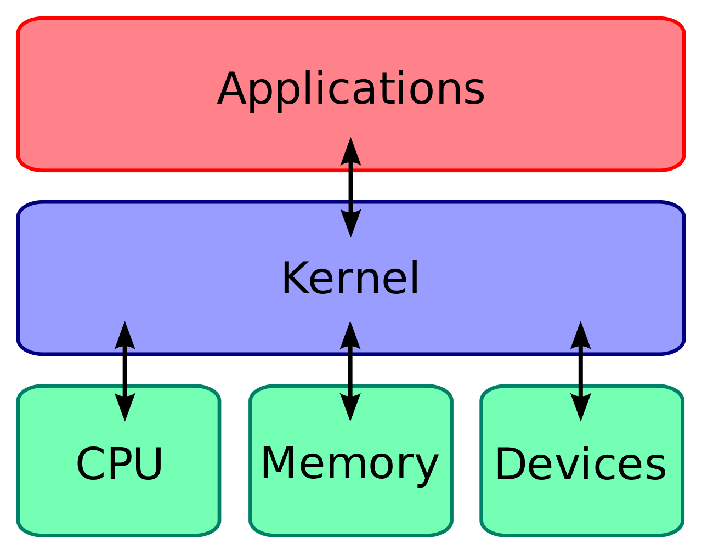

## Lab 9 Pointer Recap Document

This document summarizes the key concepts covered in Lab 9 on pointers in C, drawing information from the provided
lecture notes and examples.

**What are Pointers?**

- Pointers are special variables in C that hold memory addresses of other variables instead of actual values.
- They provide a way to directly access and manipulate data stored in memory locations.

**Key Pointer Operations:**

1. **Declaration:**
    - Declared using an asterisk (`*`) before the variable name, specifying the data type the pointer will point to.
    - Example: `int *ptr;` (declares a pointer named `ptr` that can store the address of an integer variable).

2. **Initialization:**
    - **Address-of operator (`&`):** Used to get the memory address of a variable and assign it to a pointer.
        - Example: `int num = 10; int *ptr = &num;` (`ptr` now holds the address of `num`).
    - **NULL:**  Initializes a pointer to `NULL`, indicating it doesn't point to any valid memory location.
        - Example: `int *ptr = NULL;`

3. **Dereferencing (`*`):**
    - The asterisk is used again to access the value stored at the memory location pointed to by a pointer.
    - Example: `printf("%d", *ptr);` (prints the value of the integer stored at the address held by `ptr`).

4. **Pointer Arithmetic:**
    - Basic arithmetic operations (+, -, ++, --) can be performed on pointers.
    - Operations are adjusted based on the size of the data type the pointer points to.
    - Useful for traversing arrays and memory blocks.

**Dynamic Memory Allocation:**

- Essential for creating data structures that can change size during program execution (e.g., dynamic arrays, linked
  lists).

- **`malloc(size)`:**
    - Allocates a block of memory of the specified `size` (in bytes).
    - Returns a void pointer (`void*`) to the beginning of the allocated block or `NULL` if allocation fails.
    - Requires the `<stdlib.h>` header file.

- **`free(ptr)`:**
    - Deallocates the memory previously allocated by `malloc`, `calloc`, or `realloc`.
    - Essential to prevent memory leaks.

- **`realloc(ptr, new_size)`:**
    - Resizes a previously allocated memory block to the specified `new_size`.
    - Returns a pointer to the resized block (which might be at a different location) or `NULL` if resizing fails.

**Example Use Cases:**

The provided document showcased these practical applications of pointers:

- **Reversing a String:** Using pointers to efficiently swap characters in a string.
- **Dynamic Array Allocation:**  Creating arrays whose size is determined at runtime.
- **Resizing Arrays:**  Demonstrating how `realloc` can be used to dynamically grow an array as needed.

**Key Takeaways:**

- Pointers are fundamental to C programming, providing flexibility and power in memory management.
- They are crucial for dynamic memory allocation, working with arrays and strings, and low-level programming tasks.
- Understanding how to declare, initialize, dereference, and perform arithmetic on pointers is essential for writing
  efficient C code.
- Practice and careful attention to detail are key to mastering pointers and avoiding common pitfalls like memory leaks
  and segmentation faults.

## `malloc` and the Kernel: A Simplified Explanation

While `malloc` appears to be a simple C function for allocating memory, under the hood, it collaborates with the
operating system kernel to manage your program's memory requests. Here's a simplified explanation of how this
interaction works:

**The User Space vs. Kernel Space:**

- **User Space:** Where your C programs run. You have limited, controlled access to memory.
- **Kernel Space:**  The heart of the operating system. It has complete control over system resources, including memory.

**The `malloc` Request:**

1. **Your Program Calls `malloc`:** When you call `malloc(size)` in your C code, you're asking for a chunk of memory of
   `size` bytes.

2. **`malloc` Checks its Heap:** `malloc` manages a region of memory called the heap for your program.
    - It first checks if it has a free block large enough on the heap to satisfy your request. If it finds one, it gives
      you the address of that block and you're done!

3. **Requesting More from the Kernel:** If `malloc` can't find space on the heap, it turns to the operating system
   kernel for help. This is done through a **system call** (a special way for user programs to request services from the
   kernel).

**The Kernel's Role:**

1. **Receiving the Request:**  The kernel receives the system call from `malloc`, which essentially says, "I need more
   memory, please!"

2. **Finding Available Memory:** The kernel maintains data structures to track free and allocated memory in the system.
   It searches for a suitable contiguous block of free memory that meets the requested size.

3. **Allocating Memory to the Process:** The kernel then marks that block of memory as belonging to your program's
   process and updates its internal tables.

4. **Returning to `malloc`:** The kernel returns the starting address of the newly allocated memory block to `malloc`.

**Back to Your Program:**

- `malloc` receives the memory address from the kernel, adds it to its heap management structures, and finally returns
  that address to your program. Now you can use this memory!

**Key Points to Remember:**

- **Abstraction:** `malloc` provides an abstraction layer. You don't need to worry about the complexities of system
  calls or the kernel's memory management when writing your programs.
- **System Calls Are Expensive:**  Switching between user space and kernel space (making a system call) has overhead.
  `malloc` tries to minimize these calls by managing a heap and requesting memory in larger chunks from the kernel.
- **Freeing Memory:** When you call `free()`, a similar (but reverse) process occurs, where the memory is returned to
  the kernel (or marked as free in `malloc`'s heap) for potential reuse.

**In a Nutshell:**

`malloc` acts as an intermediary between your program and the operating system kernel, providing a user-friendly way to
request and release memory. The kernel is the ultimate manager of system memory and ensures that each process gets its
fair share.
