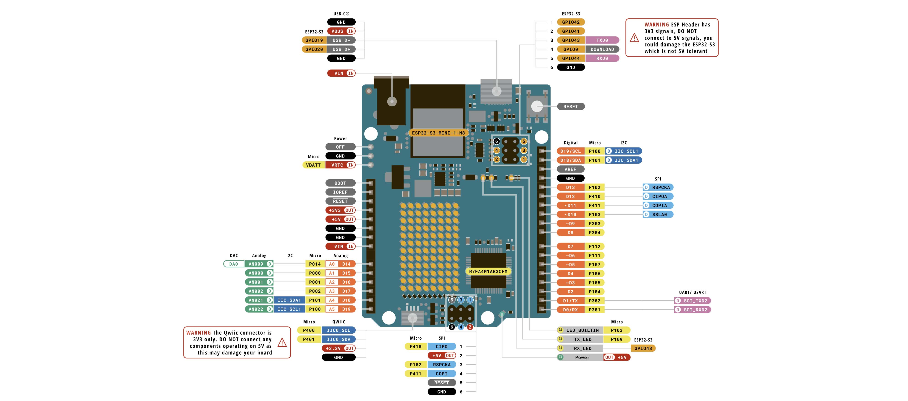
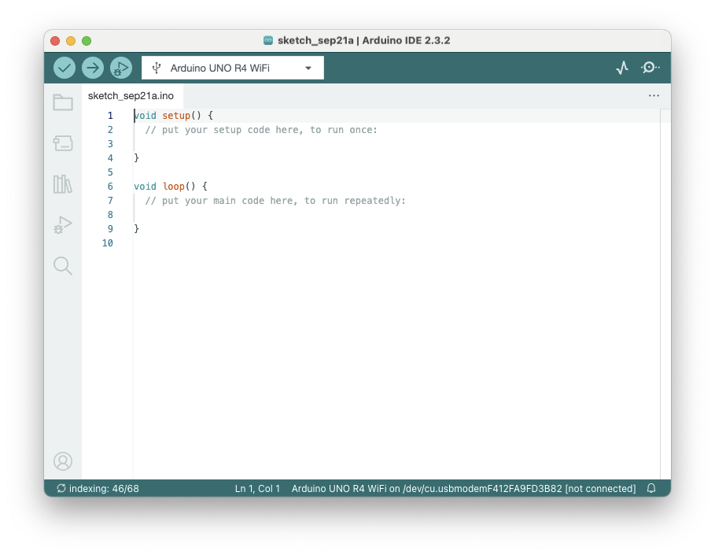

# Intro to Arduino R4 WiFi

The Arduino UNO R4 WiFi is designed around the 32-bit microcontroller RA4M1 from Renesas while also featuring a ESP32
module for Wi-Fi® and Bluetooth® connectivity. Its distinctive 12x8 LED matrix makes it possible to prototype visuals
directly on the board, and with a Qwiic connector, you can create projects plug-and-play style.



## Recommended Operating Conditions

| Symbol          | Description                          | Min | Typ | Max | Unit |
|-----------------|--------------------------------------|-----|-----|-----|------|
| V<sub>IN</sub>  | Input voltage from VIN pad / DC jack | 6   | 7.0 | 24  | V    |
| V<sub>USB</sub> | Input voltage from USB connector     | 4.8 | 5.0 | 5.5 | V    |
| T<sub>OP</sub>  | Operating Temperature                | -40 | 25  | 85  | °C   |

## Microcontroller

The UNO R4 WiFi is based on the 32-bit RA4M1 series microcontroller, R7FA4M1AB3CFM#AA0, from Renesas,
which uses a 48 MHz Arm® Cortex®-M4 microprocessor with a floating point unit (FPU).

The operating voltage for the RA4M1 is fixed at 5 V as to be hardware compatible with shields, accessories & circuits
based on previous Arduino UNO boards.

The R7FA4M1AB3CFM#AA0 features:

* 256 kB flash / 32 kB SRAM / 8 kB data flash (EEPROM)
* Real-time Clock (RTC)
* 4x Direct Memory Access Controller (DMAC)
* 14-bit ADC
* Up to 12-bit DAC
* OPAMP
* CAN bus

สถาปัตยกรรมที่ Uno R4 WiFi ใช้นั้นเป็นแบบ **RISC (Reduced Instruction Set Computer)**

## Arduino IDE

แพลตฟอร์มการเขียนโปรแกรม Arduino ถูกออกแบบเพื่อช่วยให้ผู้เริ่มต้นคุ้นเคยกับการเขียนโปรแกรม
โดยภาษาในการเขียนโค้ดคือ C/C++

โปรแกรม Arduino แต่ละตัวเรียกว่า **สเก็ตช์** (SKETCH) และจะมีฟังก์ชันที่จำเป็นสองอย่างที่เรียกว่า **รูทีน** (ROUTINES)
ครับ



Arduino Sketch คือ Source Code ที่ใช้สำหรับบอร์ด Arduino เพื่อบอกให้บอร์ดทำงานกับสิ่งรอบตัว เช่น
เซ็นเซอร์และอุปกรณ์ต่างๆ

Arduino Sketch จะมีนามสกุล `.ino`

### Anatomy of a Sketch

ทุกสเก็ตช์ Arduino จะต้องมีฟังก์ชันสำคัญสองอย่าง ได้แก่:

1. `setup()`:

    - ฟังก์ชันนี้จะถูกเรียกใช้งานครั้งเดียวเมื่อเริ่มต้นโปรแกรม
    - ใช้สำหรับการตั้งค่าเริ่มต้น เช่น กำหนดพินที่ใช้หรือเริ่มต้นตัวแปรต่างๆ

2. `loop():`

    - ฟังก์ชันนี้จะถูกเรียกใช้งานซ้ำไปเรื่อยๆ หลังจากฟังก์ชัน `setup()`
    - ใช้สำหรับการทำงานหลักของโปรแกรม เช่น
      การอ่านข้อมูลจากเซ็นเซอร์หรือควบคุมอุปกรณ์ต่างๆ
    - โค้ดทั้งหมดภายในวงเล็บปีกกาจะถูกเรียกใช้งานซ้ำไปเรื่อยๆ จนกว่าจะมีการตัดไฟออก

### Programming - Syntax

Similar to C, the formatting requirement is the same.

| Symbol  | Description                                            |
|---------|--------------------------------------------------------|
| `//`    | - Single line comment                                  |
| `/* */` | - Multiline comment                                    |
| `{}`    | - used to define a block of code that starts and ends. |
| `;`     | - used to define the end of a line of code.            | 

### Variable Types

* **Variable Types:**

| Size      | 8 bits           | 16 bits                   | 32 bits                              |
|-----------|------------------|---------------------------|--------------------------------------|
| **Types** | `byte`<br>`char` | `int` <br> `unsigned int` | `long`<br>`unsigned long`<br>`float` | 

### Arduino Functions

## Arduino Functions Overview

This slide provides a quick reference guide to commonly used functions in Arduino programming.

**Key Takeaways:**

* **Language:** Arduino programming uses standard C syntax but aims to simplify it for ease of use.
* **Core Functions:** The slide categorizes functions into four main groups:
    * **Digital I/O:** Used for basic interaction with digital pins (HIGH/LOW).
        - [`pinMode()`](https://www.arduino.cc/reference/en/language/functions/digital-io/pinmode/)
        - [`digitalWrite()`](https://www.arduino.cc/reference/en/language/functions/digital-io/digitalwrite/)
        - [`digitalRead()`](https://www.arduino.cc/reference/en/language/functions/digital-io/digitalread/)
    * **Analog I/O:**  Used for reading analog sensors and controlling analog outputs.
        - [`analogReference()`](https://www.arduino.cc/reference/en/language/functions/analog-io/analogreference/)
        - [`analogRead()`](https://www.arduino.cc/reference/en/language/functions/analog-io/analogread/)
        - [`analogWrite()`](https://www.arduino.cc/reference/en/language/functions/analog-io/analogwrite/) (often used
          for PWM)
    * **Advanced I/O:** Offers additional control over input/output operations.
        - [`tone()`](https://www.arduino.cc/reference/en/language/functions/advanced-io/tone/)
        - [`noTone()`](https://www.arduino.cc/reference/en/language/functions/advanced-io/notone/)
        - [`shiftOut()`](https://www.arduino.cc/reference/en/language/functions/advanced-io/shiftout/)
        - [`shiftIn()`](https://www.arduino.cc/reference/en/language/functions/advanced-io/shiftin/)
        - [`pulseIn()`](https://www.arduino.cc/reference/en/language/functions/advanced-io/pulsein/)
    * **Time:**  Essential for introducing delays and timing-related operations.
        - [`millis()`](https://www.arduino.cc/reference/en/language/functions/time/millis/)
        - [`micros()`](https://www.arduino.cc/reference/en/language/functions/time/micros/)
        - [`delay()`](https://www.arduino.cc/reference/en/language/functions/time/delay/)
        - [`delayMicroseconds()`](https://www.arduino.cc/reference/en/language/functions/time/delaymicroseconds/)
* **Additional Functionalities:**
    * **Math:**  Provides common mathematical functions for calculations within your code.
        - [`min()`](https://www.arduino.cc/reference/en/language/functions/math/min/)
        - [`max()`](https://www.arduino.cc/reference/en/language/functions/math/max/)
        - [`abs()`](https://www.arduino.cc/reference/en/language/functions/math/abs/)
        - [`constrain()`](https://www.arduino.cc/reference/en/language/functions/math/constrain/)
        - [`map()`](https://www.arduino.cc/reference/en/language/functions/math/map/)
        - [`pow()`](https://www.arduino.cc/reference/en/language/functions/math/pow/)
        - [`sqrt()`](https://www.arduino.cc/reference/en/language/functions/math/sqrt/)
    * **Trigonometry:** Includes trigonometric functions for advanced calculations.
        - [`sin()`](https://www.arduino.cc/reference/en/language/functions/trigonometry/sin/)
        - [`cos()`](https://www.arduino.cc/reference/en/language/functions/trigonometry/cos/)
        - [`tan()`](https://www.arduino.cc/reference/en/language/functions/trigonometry/tan/)
    * **Random Numbers:** For generating random values in your sketches.
        - [`randomSeed()`](https://www.arduino.cc/reference/en/language/functions/random-numbers/randomseed/)
        - [`random()`](https://www.arduino.cc/reference/en/language/functions/random-numbers/random/)
    * **Communication:**  Includes functions for serial communication (sending/receiving data).
        - [`Serial`](https://www.arduino.cc/reference/en/language/functions/communication/serial/) (represents the
          serial port object for communication)

This list provides a starting point for exploring the diverse range of functions available in Arduino. As you progress,
you'll likely discover and utilize even more functions tailored to specific tasks and components within your projects.

### A Simple Example: Blinking an LED

```cpp
// Define the LED pin
int ledPin = 13; 

// Setup function: runs once
void setup() {
  // Initialize the LED pin as an OUTPUT
  pinMode(ledPin, OUTPUT);
}

// Loop function: runs repeatedly
void loop() {
  // Turn the LED ON
  digitalWrite(ledPin, HIGH); 
  // Wait for 1 second
  delay(1000); 
  // Turn the LED OFF
  digitalWrite(ledPin, LOW);
  // Wait for another second
  delay(1000); 
}
```

## Ref:

- [UnoR4WiFi-datasheet.pdf](files/UnoR4WiFi-datasheet.pdf)
- https://docs.arduino.cc/hardware/uno-r4-wifi/