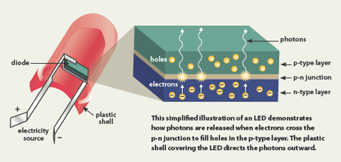
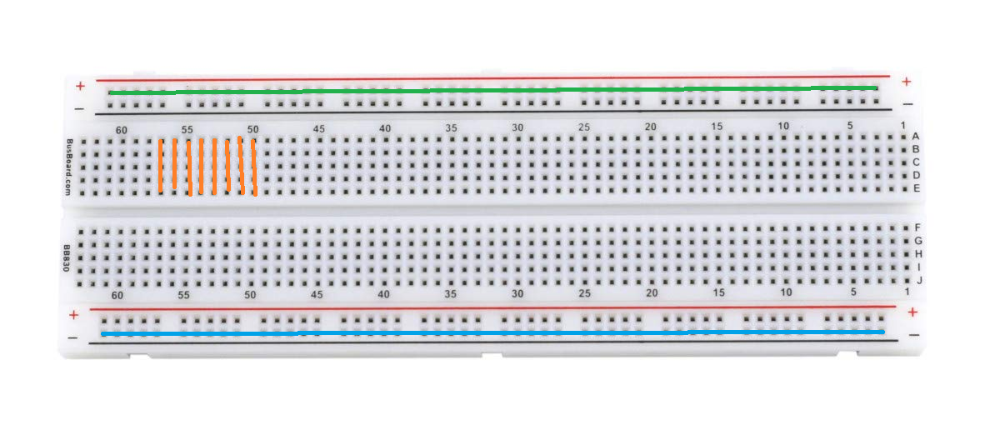
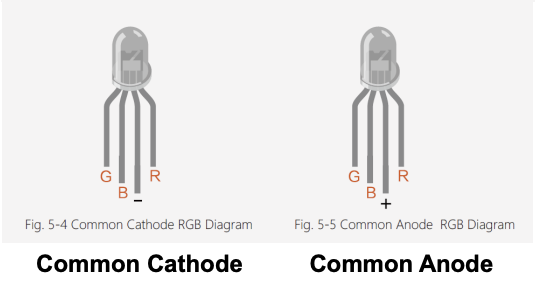
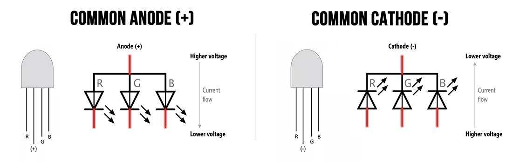
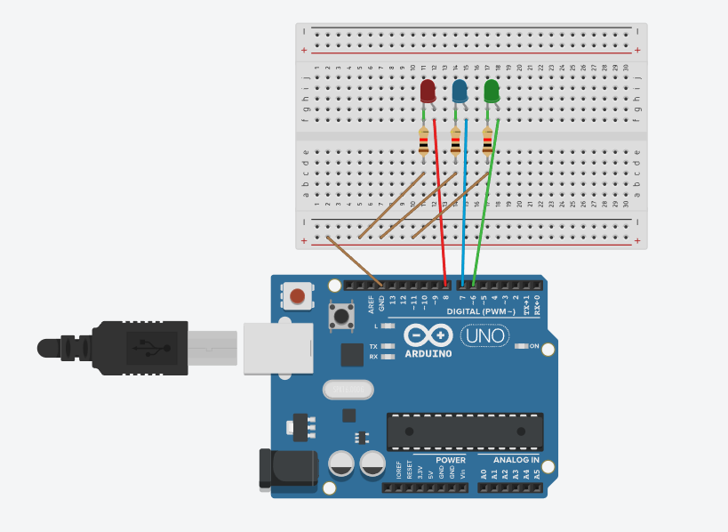
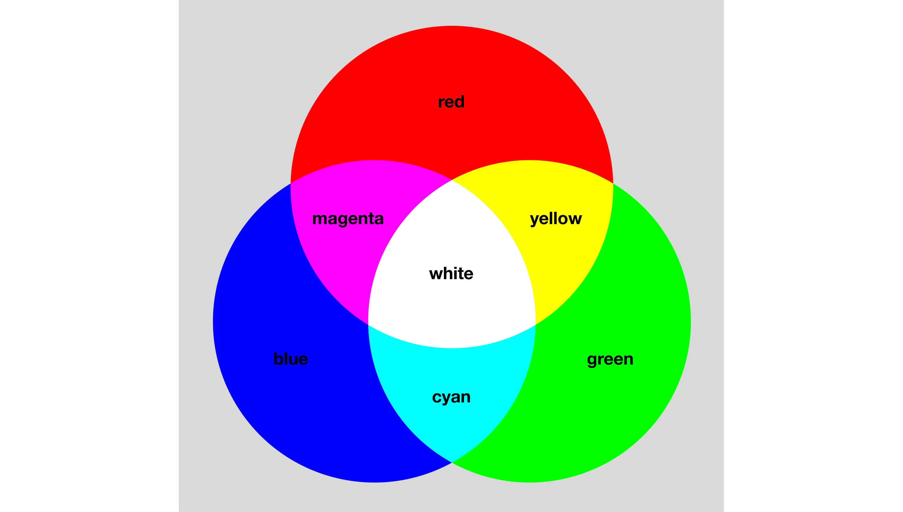
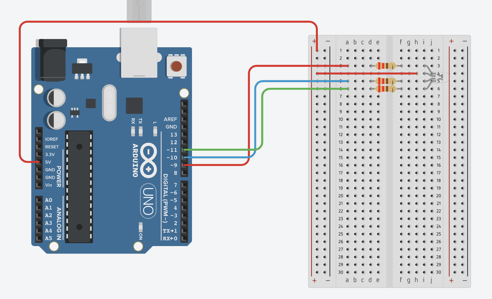

# วิธีการต่อ Breadboard กับ RGB LED

## RGB ที่แจกไปเป็นชนิด Common Anode

## รายละเอียด

ในส่วนนี้ เราจะสาธิตวิธีการต่อวงจร LED บน Breadboard ซึ่งเป็นพื้นฐานของการทำงานกับอุปกรณ์อิเล็กทรอนิกส์

## อุปกรณ์ที่ต้องใช้:

1. **Breadboard** - บอร์ดที่ใช้ในการต่อวงจร
2. **LED** (Light Emitting Diode) - อุปกรณ์แสดงผลที่สว่างขึ้นเมื่อมีกระแสไฟฟ้าไหลผ่าน
3. **ตัวต้านทาน (Resistor)** - ค่าประมาณ 220 โอห์ม เพื่อจำกัดกระแสไฟ
4. **สาย Jumper** - สายสำหรับเชื่อมต่อวงจร

## What is LED

หลอด LED หรือ Light Emitting Diode คืออุปกรณ์สารกึ่งตัวนำขนาดเล็กที่เปล่งแสงออกมาเมื่อมีกระแสไฟฟ้าไหลผ่าน
ซึ่งเป็นกระบวนการที่แตกต่างอย่างสิ้นเชิงกับหลอดไส้แบบดั้งเดิมที่สร้างแสงโดยการให้ความร้อนกับไส้หลอด
หรือหลอดฟลูออเรสเซนต์ที่ทำงานโดยการกระตุ้นก๊าซ

LEDs ทำงานโดยใช้วัสดุเซมิคอนดักเตอร์เพื่อสร้างจุดตัด P-N ซึ่งเมื่อมีการนำไฟฟ้าไปยังจุดตัดในทิศทางที่ถูกต้อง
จะทำให้อิเล็กตรอนจากภูมิภาค N-type เติมช่องว่างในภูมิภาค P-type
ส่งผลให้เกิดการปล่อยพลังงานในรูปของแสงระหว่างกระบวนการรวมตัวกัน



## การเชื่อมต่อ Breadboard

Breadboard จะมีการจัดพินตามแนว **แนวนอน** และ **แนวตั้ง**:



- แถบด้านบนกับด้านล่าง เป็นเส้นตรงแนวนอนทั้งหมด (มักจะมีแถบสีแดงหรือสีน้ำเงิน) ใช้สำหรับเชื่อมต่อกับ **แหล่งจ่ายไฟบวก (
  VCC)** และ **แหล่งจ่ายไฟลบ (GND)** ข้อสำคัญคือ ถ้าต่อไฟที่จุดใดจุดหนึ่งในแถบนี้ ทั้งแถบจะเชื่อมต่อกันเป็น **แนวนอน**
  จากภาพ

- ส่วนของพื้นที่ด้านในจะมีการเชื่อมต่อเป็น **แนวตั้ง** จากภาพ
  ซึ่งในแต่ละคอลัมน์ที่มีรูหลายรูเรียงตามแนวตั้งจะเชื่อมต่อกัน โดยคอลัมน์เหล่านี้ใช้สำหรับเชื่อมต่ออุปกรณ์ต่าง ๆ ในวงจร

## ขั้นตอนการต่อวงจร:

1. ระบุ LED **แบบ 2 ขา**


- ขา LED จะมีสองขา: ขา **Anode** (ขายาว) เป็นขาไฟบวก และขา **Cathode** (ขาสั้น) เป็นขาไฟลบ
- ขา Anode จะต้องต่อกับไฟบวก ส่วนขา Cathode ต่อกับไฟลบหรือผ่านตัวต้านทาน

2. ระบุ LED **แบบ 4 ขา**



- ขา Red (R): ขาที่เชื่อมต่อกับแสงสีแดง
- ขา Green (G): ขาที่เชื่อมต่อกับแสงสีเขียว
- ขา Blue (B): ขาที่เชื่อมต่อกับแสงสีน้ำเงิน
- ขา Common (C): ขาอาจจะเป็นขา Common Anode (CA) หรือ Common Cathode (CC)

**กรณีนี้ต้องดูว่าตัว LED ที่เราได้มานั้นขาเป็น Cathode หรือ Anode**

- **Common Anode (CA)**: ขา Common จะเชื่อมต่อกับแหล่งจ่ายไฟบวก (VCC) และขาสีอื่น ๆ จะต้องต่อไปยัง GND เพื่อให้แสงสว่าง
- **Common Cathode (CC)**: ขา Common จะเชื่อมต่อกับ GND และขาสีอื่น ๆ จะต้องต่อไปยัง VCC เพื่อให้แสงสว่าง



3. **ต่อ LED บน Breadboard**
    - เสียบขา Anode ของ LED ลงใน Breadboard โดยให้ขานี้เชื่อมต่อกับสายไฟบวก (VCC)
    - เสียบขา Cathode ของ LED ลงบน Breadboard โดยเชื่อมต่อกับตัวต้านทานเพื่อป้องกันการจ่ายไฟเกิน

4. **ต่อ Resistor**
    - นำตัวต้านทานมาต่อจากขา Cathode ของ LED โดยขาอีกด้านของตัวต้านทานต่อกับแถบ GND ของ Breadboard
      เพื่อควบคุมกระแสไฟฟ้าที่ผ่าน LED

5. **ต่อสาย Jumper**
    - ใช้สาย Jumper ต่อจากแถบไฟบวก (VCC) ไปยังขา Anode ของ LED
    - ใช้สาย Jumper อีกเส้นต่อจากแถบ GND ไปยังขาตัวต้านทาน เพื่อเชื่อมต่อวงจร

## ตัวอย่างแผนผังการต่อวงจร:



## การระบุพอร์ตในการเขียนโปรแกรม

เมื่อเขียนโปรแกรมเพื่อควบคุม LED RGB จะต้องระบุพอร์ตสำหรับแต่ละขาอย่างชัดเจน เช่น:

```cpp
// กำหนดพอร์ตสำหรับ LED RGB
const int RED_PIN = 8;    // ขา Red
const int GREEN_PIN = 6;  // ขา Green
const int BLUE_PIN = 7;   // ขา Blue

void setup() {
  // กำหนดพอร์ตให้เป็น OUTPUT
  pinMode(RED_PIN, OUTPUT);
  pinMode(GREEN_PIN, OUTPUT);
  pinMode(BLUE_PIN, OUTPUT);
}

void loop() {
  // let you cook here
}
```

## ตัวอย่างการเขียนโค้ดเกี่ยวกับ LED

```cpp
// กำหนดพอร์ตสำหรับ LED
const int LED_PIN = 9;  // ขา LED ต่อกับพอร์ต 9

void setup() {
  // กำหนดพอร์ตให้เป็น OUTPUT
  pinMode(LED_PIN, OUTPUT);
}

void loop() {
  // เปิด LED
  digitalWrite(LED_PIN, HIGH);  // ตั้งค่าให้ LED ติด
  delay(1000);                  // หน่วงเวลา 1 วินาที (1000 มิลลิวินาที)

  // ปิด LED
  digitalWrite(LED_PIN, LOW);   // ตั้งค่าให้ LED ดับ
  delay(1000);                  // หน่วงเวลา 1 วินาที (1000 มิลลิวินาที)
}
```

## วิธีการต่อ RGB Common Anode

   
