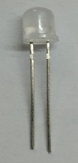
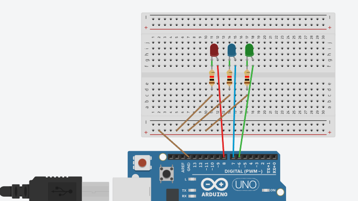

# วิธีการต่อ Breadboard กับ RGB LED

## รายละเอียด

ในส่วนนี้ เราจะสาธิตวิธีการต่อวงจร LED บน Breadboard ซึ่งเป็นพื้นฐานของการทำงานกับอุปกรณ์อิเล็กทรอนิกส์

## อุปกรณ์ที่ต้องใช้:
1. **Breadboard** - บอร์ดที่ใช้ในการต่อวงจร
2. **LED** (Light Emitting Diode) - อุปกรณ์แสดงผลที่สว่างขึ้นเมื่อมีกระแสไฟฟ้าไหลผ่าน
3. **ตัวต้านทาน (Resistor)** - ค่าประมาณ 220 โอห์ม เพื่อจำกัดกระแสไฟ
4. **สาย Jumper** - สายสำหรับเชื่อมต่อวงจร

## การเชื่อมต่อ Breadboard
Breadboard จะมีการจัดพินตามแนว **แนวนอน** และ **แนวตั้ง**:

- แถบด้านบนกับด้านล่าง เป็นเส้นตรงแนวนอนทั้งหมด (มักจะมีแถบสีแดงหรือสีน้ำเงิน) ใช้สำหรับเชื่อมต่อกับ **แหล่งจ่ายไฟบวก (VCC)** และ **แหล่งจ่ายไฟลบ (GND)** ข้อสำคัญคือ ถ้าต่อไฟที่จุดใดจุดหนึ่งในแถบนี้ ทั้งแถบจะเชื่อมต่อกันเป็น **แนวนอน** จากภาพ

- ส่วนของพื้นที่ด้านในจะมีการเชื่อมต่อเป็น **แนวตั้ง** จากภาพ ซึ่งในแต่ละคอลัมน์ที่มีรูหลายรูเรียงตามแนวตั้งจะเชื่อมต่อกัน โดยคอลัมน์เหล่านี้ใช้สำหรับเชื่อมต่ออุปกรณ์ต่าง ๆ ในวงจร

## ขั้นตอนการต่อวงจร:

1. ระบุ LED **แบบ 2 ขา**

   - ขา LED จะมีสองขา: ขา **Anode** (ขายาว) เป็นขาไฟบวก และขา **Cathode** (ขาสั้น) เป็นขาไฟลบ
   - ขา Anode จะต้องต่อกับไฟบวก ส่วนขา Cathode ต่อกับไฟลบหรือผ่านตัวต้านทาน

2.  ระบุ LED **แบบ 4 ขา**

   - ขา Red (R): ขาที่เชื่อมต่อกับแสงสีแดง
   - ขา Green (G): ขาที่เชื่อมต่อกับแสงสีเขียว
   - ขา Blue (B): ขาที่เชื่อมต่อกับแสงสีน้ำเงิน
   - ขา Common (C): ขาอาจจะเป็นขา Common Anode (CA) หรือ Common Cathode (CC)

 **กรณีนี้ต้องดูว่าตัว LED ที่เราได้มานั้นขาเป็น Cathode หรือ Anode**
	   - **Common Anode (CA)**: ขา Common จะเชื่อมต่อกับแหล่งจ่ายไฟบวก (VCC) และขาสีอื่น ๆ จะต้องต่อไปยัง GND เพื่อให้แสงสว่าง
	   - **Common Cathode (CC)**: ขา Common จะเชื่อมต่อกับ GND และขาสีอื่น ๆ จะต้องต่อไปยัง VCC เพื่อให้แสงสว่าง

3. **ต่อ LED บน Breadboard**
   - เสียบขา Anode ของ LED ลงใน Breadboard โดยให้ขานี้เชื่อมต่อกับสายไฟบวก (VCC)
   - เสียบขา Cathode ของ LED ลงบน Breadboard โดยเชื่อมต่อกับตัวต้านทานเพื่อป้องกันการจ่ายไฟเกิน

4. **ต่อ Resistor**
   - นำตัวต้านทานมาต่อจากขา Cathode ของ LED โดยขาอีกด้านของตัวต้านทานต่อกับแถบ GND ของ Breadboard เพื่อควบคุมกระแสไฟฟ้าที่ผ่าน LED

5. **ต่อสาย Jumper**
   - ใช้สาย Jumper ต่อจากแถบไฟบวก (VCC) ไปยังขา Anode ของ LED
   - ใช้สาย Jumper อีกเส้นต่อจากแถบ GND ไปยังขาตัวต้านทาน เพื่อเชื่อมต่อวงจร

## ตัวอย่างแผนผังการต่อวงจร:

