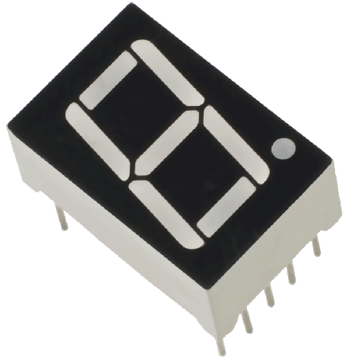
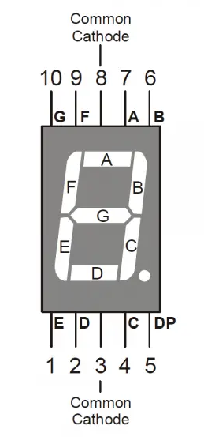
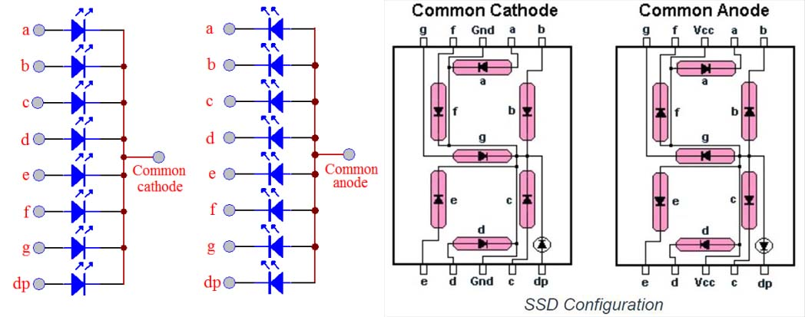
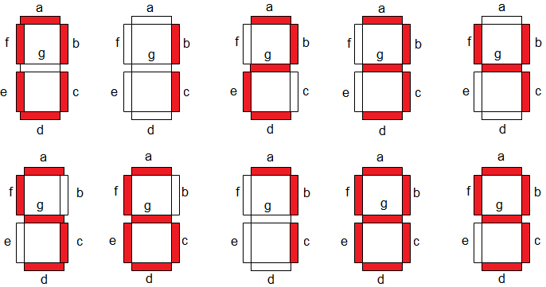
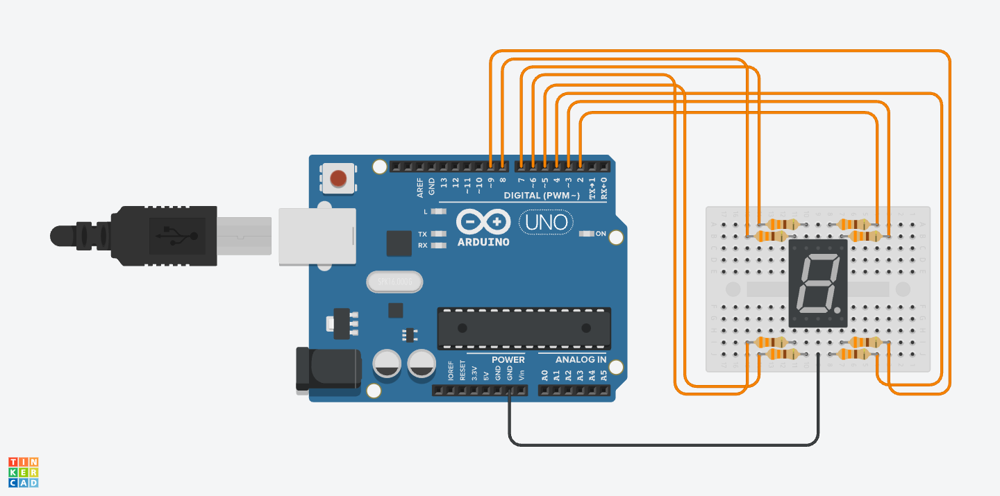

# 7-Segment Display with Arduino

## หน้าตาของอุปกรณ์ 7-segment



## ระบุตำแหน่งขาของ 7-segment



## ระวัง Common Anode กับ Common Cathode



## ตัวอย่างการแสดงผลในรูปแบบตัวเลข



## การเชื่อมต่อ Pin กับ 7-segment

**ตัวอย่าง การกำหนดขาเชื่อมต่อ 7-segment display**:

- ขา A (ขา 7) → Digital Pin 2
- ขา B (ขา 6) → Digital Pin 3
- ขา C (ขา 4) → Digital Pin 4
- ขา D (ขา 2) → Digital Pin 5
- ขา E (ขา 1) → Digital Pin 6
- ขา F (ขา 9) → Digital Pin 7
- ขา G (ขา 10) → Digital Pin 8
- ขา Common (ขา 3) → GND (ถ้าเป็น Common Cathode) หรือ +5V (ถ้าเป็น Common Anode)

## Labs 03: วิธีการต่อ 7 Segment (Common Cathode) แบบ 1 ตัว

มีวิธีที่ดีกว่านี้เพียงแค่ใช้ Array ในการเก็บ Pin ที่ต้องเปิดของตัวเลขแต่ละตัว

**Tinkercad:**
https://www.tinkercad.com/things/eMgolJBjfB4-arduino-7-segment-display-common-cathode?sharecode=obS0eusqqYM8q-2Yjtl2wpl8u_L5XufAHJziz3IJyjc



```cpp
int num_array[10][7] = {  { 1,1,1,1,1,1,0 },    // 0
                          { 0,1,1,0,0,0,0 },    // 1
                          { 1,1,0,1,1,0,1 },    // 2
                          { 1,1,1,1,0,0,1 },    // 3
                          { 0,1,1,0,0,1,1 },    // 4
                          { 1,0,1,1,0,1,1 },    // 5
                          { 1,0,1,1,1,1,1 },    // 6
                          { 1,1,1,0,0,0,0 },    // 7
                          { 1,1,1,1,1,1,1 },    // 8
                          { 1,1,1,0,0,1,1 }};   // 9

// Define the pins for each segment of the 7-segment display
const int segment_a = 2; 
const int segment_b = 3; 
const int segment_c = 4;
const int segment_d = 5;
const int segment_e = 6;
const int segment_f = 7;
const int segment_g = 8;

void setup() { 
  // set pin modes for each segment
  pinMode(segment_a, OUTPUT);   
  pinMode(segment_b, OUTPUT);   
  pinMode(segment_c, OUTPUT);   
  pinMode(segment_d, OUTPUT);   
  pinMode(segment_e, OUTPUT);   
  pinMode(segment_f, OUTPUT);   
  pinMode(segment_g, OUTPUT);   
}

void loop() {
  // Loop through each digit (0-9)
  for (int digit = 0; digit < 10; digit++) {
    displayDigit(digit);
    delay(1000); // Wait for 1 second before displaying the next digit
  }
}

// Function to display a specific digit on the 7-segment display
void displayDigit(int digit) {
  // Set each segment according to the num_array for the given digit
  digitalWrite(segment_a, num_array[digit][0]);
  digitalWrite(segment_b, num_array[digit][1]);
  digitalWrite(segment_c, num_array[digit][2]);
  digitalWrite(segment_d, num_array[digit][3]);
  digitalWrite(segment_e, num_array[digit][4]);
  digitalWrite(segment_f, num_array[digit][5]);
  digitalWrite(segment_g, num_array[digit][6]);
}
```

---

## Labs 04: วิธีการต่อ 7 Segment (Common Cathode) แบบ 2 ตัว


**Tinkercad:**
https://www.tinkercad.com/things/0UFIFnMgv3X-arduino-7-segment-display-2-digit-common-cathode?sharecode=r6QYv58_iq_AP0dGzT7TQb2cb2Nh-sM8MlHVzgRnydk


## Explanation of the Code and Circuit

This code controls two seven-segment displays connected to an Arduino Uno to display a scrolling sequence of two-digit
numbers. The circuit utilizes resistors to limit current to the LEDs in the seven-segment displays.

### Code Breakdown

**1. Definitions:**

- `segments[]`: Stores the Arduino pins connected to segments a-g of the seven-segment displays.
- `leftSegment`, `rightSegment`: Store the pins connected to the common anode/cathode of the left and right displays
  respectively.
- `digitPatterns[][]`: A 2D array defining the segment patterns for digits 0-9. Each row represents a digit, and each
  column corresponds to a segment (a-g). A '1' means the segment should be on, '0' means off.
- `text[]`: The string of digits to be displayed sequentially.

**2. `setup()`:**

- Initializes serial communication for debugging (not used in this example).
- Sets the segment pins and display enable pins as outputs.

**3. `loop()`:**

- Iterates through the `text` string, taking two digits at a time.
- Calls `showTwoDigits()` to display each pair of digits for one second.

**4. `showTwoDigits(digit1, digit2)`:**

- Takes two digits as input.
- Uses a `millis()`-based timer to control the display duration (1 second).
- Alternates between displaying `digit1` on the right display and `digit2` on the left display with a short delay (50ms)
  between each, creating a multiplexing effect.

**5. `displayDigit(digit, activeSegment)`:**

- Takes the digit to display and the active segment (left or right) as input.
- Enables the appropriate display by setting its common pin (`leftSegment` or `rightSegment`) HIGH. The other display is
  disabled by setting its common pin LOW.
- Iterates through the `digitPatterns` array and sets the corresponding segment pins HIGH or LOW to form the desired
  digit.

### Circuit Explanation

The circuit consists of an Arduino Uno, two seven-segment displays, and resistors.

- Each segment (a-g) of both displays is connected to a corresponding pin on the Arduino through a resistor. The
  resistors limit the current flowing through the LED segments, preventing damage.
- The common anode/cathode pin of each display is connected to a separate Arduino pin (`leftSegment`, `rightSegment`).
  This allows individual control of each display for multiplexing.

### Using a Multiplexer

Instead of using individual pins to control the common anode/cathode of each display, a multiplexer can be used to
reduce the number of Arduino pins required.

**How it works:**

1. Connect the common anode/cathode pins of both displays to the output of a 2-to-1 multiplexer.
2. Connect the select pin of the multiplexer to an Arduino digital pin.
3. In the `displayDigit()` function, control the select pin to choose which display is active. For example, setting the
   select pin HIGH might enable the left display, and LOW might enable the right display.

**Benefits:**

- Reduces the number of Arduino pins required for controlling the displays.
- Simplifies the wiring slightly.

**Example Circuit with Multiplexer (using a 74HC4051 8-channel analog multiplexer):**

1. Connect the common anode/cathode pins of both displays to pin 3 (output) of the 74HC4051.
2. Connect pin 9 (VCC) of the 74HC4051 to 5V on the Arduino.
3. Connect pin 8 (GND) of the 74HC4051 to GND on the Arduino.
4. Connect pins A, B, and C (pins 11, 10, and 9 respectively) of the 74HC4051 to GND (since we only need one output
   channel).
5. Connect pin 6 (INH) of the 74HC4051 to GND (to enable the multiplexer).
6. Connect pin 7 (S0/A) of the 74HC4051 to an Arduino digital pin (e.g., pin 9).

Modify the `displayDigit()` function to control pin 9:

```c++
void displayDigit(int digit, int activeSegment) {
  digitalWrite(9, activeSegment == leftSegment ? HIGH : LOW); // Control multiplexer select pin

  // ... (rest of the function remains the same)
}
```

This setup uses a single Arduino pin to control which display is active through the multiplexer. Remember to adjust the
code and circuit connections according to the specific multiplexer you are using.