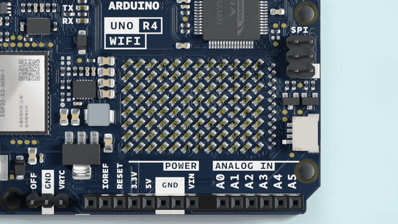
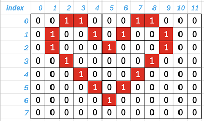
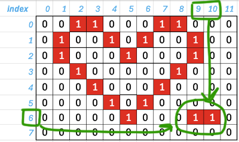

# Using the Arduino UNO R4 WiFi LED Matrix

Get off the ground with the Arduino UNO R4 WiFi built-in LED matrix. Learn the different techniques for controlling it,
create animations, graphics or even games.

The **Arduino UNO R4 WiFi** comes with a built in 12x8 LED Matrix, that is available to be programmed to display
graphics,
animations, act as an interface, or even play games on.

## Goals

The matrix and its API are developed to be programmed in a few different ways, each suited for different applications.
This guide will walk you through the basic concepts for programming the LED matrix, and get you started with creating
your own animations, while highlighting two different ways of handling the LEDs to create animations and images. This
makes it easier for you to decide what method fits your needs best!



## Hardware & Software Needed

- Arduino UNO R4 WiFi
- UNO R4 Board Package (latest version)
- Arduino IDE

## Initializing Your Arduino LED Matrix with Arduino_LED_Matrix Library

This document explains the essential steps to start using an 12x8 LED Matrix with your Arduino and the
`Arduino_LED_Matrix` library.

**Step 1: Include the Library**

At the very beginning of your Arduino sketch (`.ino` file), add the following line:

```cpp
#include "Arduino_LED_Matrix.h"
```

This line incorporates the necessary functions and definitions from the `Arduino_LED_Matrix` library into your project.
This library simplifies the process of controlling and displaying graphics on the LED Matrix.

**Step 2: Create a Matrix Object**

Right below the `#include` statement, create an instance of the `ArduinoLEDMatrix` class like this:

```cpp
ArduinoLEDMatrix matrix;
```

This creates an object called `matrix` that represents your physical LED Matrix. You'll interact with this object to
send commands and display content on the matrix.

**Step 3: Initialize the Matrix in `setup()`**

In your Arduino sketch's `setup()` function, which runs once at the beginning of your program, initialize the LED
Matrix:

```cpp
void setup() {
  Serial.begin(115200); // Optional, for debugging
  matrix.begin();        // Initialize the LED Matrix
}
```

- `Serial.begin(115200);` is optional but recommended for debugging. It starts serial communication so you can send
  messages from your Arduino to your computer.
- **The crucial line is `matrix.begin();`**, which initializes the `matrix` object and prepares the LED Matrix for
  receiving data and displaying content.

**Complete Initialization Code:**

```cpp
#include "Arduino_LED_Matrix.h"

ArduinoLEDMatrix matrix;

void setup() {
  Serial.begin(115200); 
  matrix.begin();
}

void loop() {
  // Add your LED matrix display code here!
}
```

With these three steps, your LED Matrix is initialized and ready to display graphics or text controlled by your code
within the `loop()` function.

## Create an image using Frame Gallery

We've designed a gallery of frames and animations that are included in the library! You may load and display them on
your UNO R4 WiFi with the following code snippet:

```cpp
#include "Arduino_LED_Matrix.h"   // Include the LED_Matrix library

ArduinoLEDMatrix matrix;          // Create an instance of the ArduinoLEDMatrix class

void setup() {
  Serial.begin(115200);           // Initialize serial communication at a baud rate of 115200
  matrix.begin();                 // Initialize the LED matrix

}

void loop() {
  // Load and display the basic emoji frame on the LED matrix
  matrix.loadFrame(LEDMATRIX_EMOJI_BASIC);
}
```

By changing the parameter in matrix.loadFrame() in the loop, you can choose among the available frames we designed.

The available **frames** are:

- `LEDMATRIX_BLUETOOTH`
- `LEDMATRIX_BOOTLOADER_ON`
- `LEDMATRIX_CHIP`
- `LEDMATRIX_CLOUD_WIFI`
- `LEDMATRIX_DANGER`
- `LEDMATRIX_EMOJI_BASIC`
- `LEDMATRIX_EMOJI_HAPPY`
- `LEDMATRIX_EMOJI_SAD`
- `LEDMATRIX_HEART_BIG`
- `LEDMATRIX_HEART_SMALL`
- `LEDMATRIX_LIKE`
- `LEDMATRIX_MUSIC_NOTE`
- `LEDMATRIX_RESISTOR`
- `LEDMATRIX_UNO`

This code will cycle through all the available frames:

```cpp
#include "Arduino_LED_Matrix.h"

ArduinoLEDMatrix matrix;

// Define an array of available frame names
const char* frames[] = {
  "LEDMATRIX_BLUETOOTH",
  "LEDMATRIX_BOOTLOADER_ON",
  "LEDMATRIX_CHIP",
  "LEDMATRIX_CLOUD_WIFI",
  "LEDMATRIX_DANGER",
  "LEDMATRIX_EMOJI_BASIC",
  "LEDMATRIX_EMOJI_HAPPY",
  "LEDMATRIX_EMOJI_SAD",
  "LEDMATRIX_HEART_BIG",
  "LEDMATRIX_HEART_SMALL",
  "LEDMATRIX_LIKE",
  "LEDMATRIX_MUSIC_NOTE",
  "LEDMATRIX_RESISTOR",
  "LEDMATRIX_UNO"
};

// Number of frames in the array
const int numFrames = sizeof(frames) / sizeof(frames[0]);

// Current frame index
int currentFrame = 0;

void setup() {
  Serial.begin(115200);
  matrix.begin();
}

void loop() {
  // Load and display the current frame
  matrix.loadFrame(frames[currentFrame]);

  // Increment frame index for next cycle
  currentFrame = (currentFrame + 1) % numFrames;

  // Adjust delay as needed for desired frame rate
  delay(1000); // Change frame every 1 second
}
```

## Heart Bitmap Display on Arduino LED Matrix

This code displays a heart-shaped bitmap image on an 8x12 Arduino LED matrix using the Arduino_LED_Matrix library.

**1. Include Header File:**

```cpp
#include "Arduino_LED_Matrix.h"
```

Includes the necessary header file for the `Arduino_LED_Matrix` library.

**2. Create Matrix Object:**

```cpp
ArduinoLEDMatrix matrix;
```

Creates an instance of the `ArduinoLEDMatrix` class named `matrix`.

**3. Define Bitmap Image:**

```cpp
byte image[8][12] = {
  { 0, 0, 1, 1, 0, 0, 0, 1, 1, 0, 0, 0 },
  { 0, 1, 0, 0, 1, 0, 1, 0, 0, 1, 0, 0 },
  { 0, 1, 0, 0, 0, 1, 0, 0, 0, 1, 0, 0 },
  { 0, 0, 1, 0, 0, 0, 0, 0, 1, 0, 0, 0 },
  { 0, 0, 0, 1, 0, 0, 0, 1, 0, 0, 0, 0 },
  { 0, 0, 0, 0, 1, 0, 1, 0, 0, 0, 0, 0 },
  { 0, 0, 0, 0, 0, 1, 0, 0, 0, 0, 0, 0 },
  { 0, 0, 0, 0, 0, 0, 0, 0, 0, 0, 0, 0 }
};
```



Defines a two-dimensional byte array `image` representing the heart bitmap. Each element corresponds to an LED in the
matrix, with `1` representing an illuminated LED and `0` representing an off LED.

**4. Setup Function:**

```cpp
void setup() {
  Serial.begin(115200); // Optional: Initialize serial communication
  matrix.begin(); // Initialize the LED matrix
}
```

Initializes the serial communication (optional) and the LED matrix using `matrix.begin()`.

**5. Loop Function:**

```cpp
void loop() {
  matrix.renderBitmap(image, 8, 12); // Display the heart bitmap
  
  delay(100); // Wait for 100 milliseconds
}
```

Continuously displays the heart bitmap on the LED matrix using `matrix.renderBitmap(image, 8, 12)`. The `delay(100)`
function introduces a short pause between each display cycle, preventing flickering.

**How it Works:**

The code first defines a heart-shaped bitmap image using a two-dimensional array. In the `loop()` function, it
repeatedly calls `matrix.renderBitmap()`, which takes the bitmap image and its dimensions as arguments. This function
then illuminates the LEDs on the matrix according to the bitmap data, creating the heart shape.

**Note:** This code assumes you have correctly wired your LED matrix to your Arduino board. Refer to the
`Arduino_LED_Matrix` library documentation for specific wiring instructions and potential modifications needed for your
setup.

```cpp
#include "Arduino_LED_Matrix.h"

ArduinoLEDMatrix matrix;

byte image[8][12] = {
  { 0, 0, 1, 1, 0, 0, 0, 1, 1, 0, 0, 0 },
  { 0, 1, 0, 0, 1, 0, 1, 0, 0, 1, 0, 0 },
  { 0, 1, 0, 0, 0, 1, 0, 0, 0, 1, 0, 0 },
  { 0, 0, 1, 0, 0, 0, 0, 0, 1, 0, 0, 0 },
  { 0, 0, 0, 1, 0, 0, 0, 1, 0, 0, 0, 0 },
  { 0, 0, 0, 0, 1, 0, 1, 0, 0, 0, 0, 0 },
  { 0, 0, 0, 0, 0, 1, 0, 0, 0, 0, 0, 0 },
  { 0, 0, 0, 0, 0, 0, 0, 0, 0, 0, 0, 0 }
};

void setup() {
  Serial.begin(115200);
  matrix.begin();
}

void loop() {
  matrix.renderBitmap(image, 8, 12);
  
  delay(100);
}

```

We can change the values in the image array by accessing it. Assuming that we want to add 2 more dots at the lower right conor into our bitmap image.



You can see that the new 2 dots is located at column 9, 10 and both in row 6. By accessing the array elements, you can use the array access methods in C

```cpp
void loop() {
  matrix.renderBitmap(image, 8, 12);
  
  delay(1000);
  
  image[6][9] = 1;
  image[6][10] = 1;
  
  matrix.renderBitmap(image, 8, 12);
  delay(1000);
  
  image[6][9] = 0;
  image[6][10] = 0;
}
```

Or you can change the whole array:

```cpp
void loop() {
  matrix.renderBitmap(image, 8, 12);
  
  delay(1000);
  
  for (int i = 0; i < 8; i++) {
        for (int j = 0; j < 12; j++) {
            image[i][j] = (image[i][j] == 0) ? 1 : 0;
        }
    }
  
  matrix.renderBitmap(image, 8, 12);
  delay(1000);
  
  for (int i = 0; i < 8; i++) {
        for (int j = 0; j < 12; j++) {
            image[i][j] = (image[i][j] == 0) ? 1 : 0;
        }
    }
}
```

## Heart Bitmap Display on Arduino LED Matrix using HEX

Image


## References

- https://docs.arduino.cc/tutorials/uno-r4-wifi/led-matrix/
- https://www.youtube.com/watch?v=aWScX8IOEfw