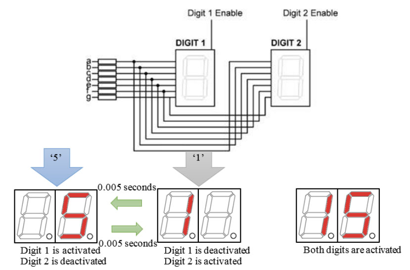

# Week 11 - Introduction to Microcontroller

## Today Topics

1. [Intro to Arduino-R4-WiFi](01.Arduino-R4-WiFi)
2. [LED Matrix](02.LED_Matrix)
3. [RGB LED](03.RGB%20LED.md)
4. [7 Segment](04.7%20Segment.md)

## Today Exercises

เข็คส่งงาน: https://bit.ly/PhyCom2024Score

1. **LED Matrix**: ให้สร้างเป็นตัวอักษรแรกของชื่อเล่นของตัวเองเป็นภาษาอังกฤษออกทาง LED Matrix
   โดยแต่ละตัวอักษรต้องอยู่คนละเฟรม เช่น
    - **TAE:** ให้แสดงเป็น `T`, `A` และ `E`
      
2. **Blinking LED**: ให้เขียนโปรแกรมและใช้งานร่วมกับหลอดไฟ LED เพื่อให้หลอดไฟนั้นกระพิบเป็นจังหวะเรื่อยๆ
    - สามารถกำหนดความถี่ในการกระพิบเองได้
    - ให้ต่อ Resistor เข้ากับ LED ด้วยเพื่อป้องกันหลอดขาด
3. **RGB**: จงเขียนโปรแกรมแสดงสี 7 สี โดยเว้นช่วงสีละ 1 วินาที
   
4. **7Segment**: จงเขียนโปรแกรมแสดงเลขทีละ 2 หลักท้ายของรหัสนักศึกษา
    - เช่นรหัส 66070012 ก็แสดง 64 07 00 12 ช่วงละ 1 วินาที
      
    - Hint: ใช้วิธี Multiplexing

## How to install Arduino

Go to https://www.arduino.cc/en/software

เมื่อ Install เสร็จแล้วให้เปิดโปรแกรม Arduino ขึ้นมาและไปโหลด Board `Arduino UNO R4`

