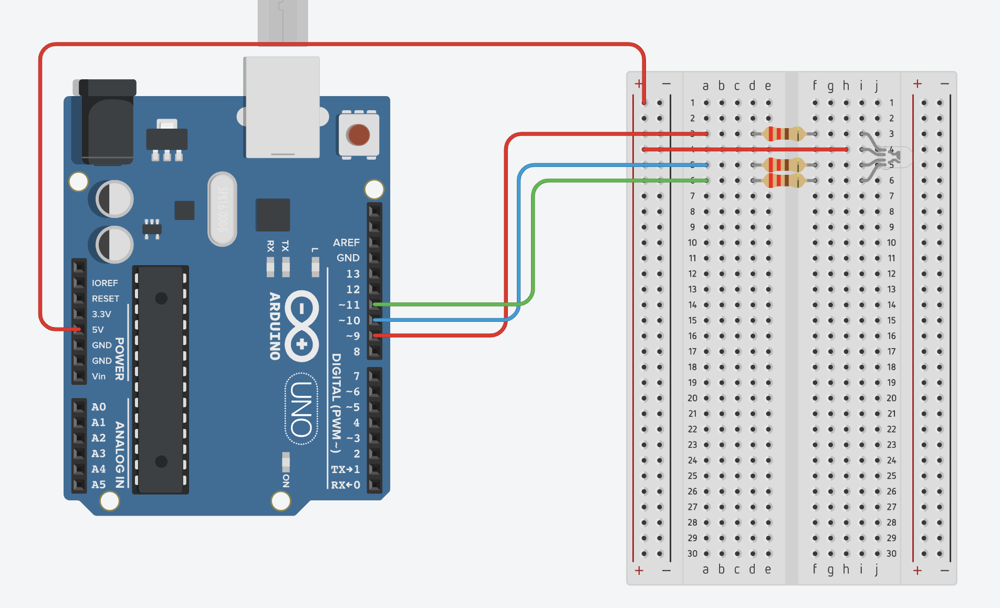

# Week 11 - Introduction to Microcontroller

## Today Topics

1. [Intro to Arduino-R4-WiFi](01.Arduino-R4-WiFi.md)
2. [LED Matrix](02.LED_Matrix.md)
3. [RGB LED](03.RGB%20LED.md)
4. [7 Segment](04.7%20Segment.md)

## Today Exercises

**เข็คส่งงาน:** https://bit.ly/PhyCom2024Score

| ข้อ                        | รายละเอียด                                                                                                                                                                                                                                                                                                                                                                                                                              | ตัวอย่าง                                                                                            |
|----------------------------|-----------------------------------------------------------------------------------------------------------------------------------------------------------------------------------------------------------------------------------------------------------------------------------------------------------------------------------------------------------------------------------------------------------------------------------------|-----------------------------------------------------------------------------------------------------|
| **1. LED Matrix:**         | ให้สร้างเป็นตัวอักษรของชื่อเล่นของตัวเองเป็นภาษาอังกฤษออกทาง LED Matrix โดยแต่ละตัวอักษรต้องอยู่คนละเฟรม                                                                                                                                                                                                                                                                                                                                | **TAE:** ให้แสดงเป็น `T`, `A` และ `E`                             |
| **2. RGB:**                | จงเขียนโปรแกรมแสดงสี 7 สี โดยเว้นช่วงสีละ 1 วินาที    - **RGB ที่แจกคือประเภท Common Anode**    **Hint:** [วิธีการต่อ](03.RGB%20LED.md#วิธีการต่อ-rgb-common-anode)                                                                                                                                                                                                                                                     |                                              |
| **3. 7Segment (1 digit):** | จงเขียนโปรแกรมแสดงเลข 0-9 โดยเว้นช่วงละ 1 วินาที      - **Hint:** [วิธีการต่อ](04.7%20Segment.md#labs-03-วิธีการต่อ-7-segment-common-cathode-แบบ-1-ตัว)   - [Tinkercad](https://www.tinkercad.com/things/eMgolJBjfB4-arduino-7-segment-display-common-cathode?sharecode=obS0eusqqYM8q-2Yjtl2wpl8u_L5XufAHJziz3IJyjc)                                                                                                        |                                               | 
| **4. 7Segment (2 digit):** | จงเขียนโปรแกรมแสดงเลขทีละ 2 หลักท้ายของรหัสนักศึกษา   - เช่นรหัส 66070012 ก็แสดง 64 07 00 12 ช่วงละ 1 วินาที   - Hint: ใช้วิธี Multiplexing      - **Hint:** [วิธีการต่อ](04.7%20Segment.md#labs-04-วิธีการต่อ-7-segment-common-cathode-แบบ-2-ตัว) - [Tinkercad](https://www.tinkercad.com/things/0UFIFnMgv3X-arduino-7-segment-display-2-digit-common-cathode?sharecode=r6QYv58_iq_AP0dGzT7TQb2cb2Nh-sM8MlHVzgRnydk) |  | 

สไลด์ Lecture: [PC67-12_Micro01.pdf](files/PC67-12_Micro01.pdf)

## How to install Arduino

Go to https://www.arduino.cc/en/software

เมื่อ Install เสร็จแล้วให้เปิดโปรแกรม Arduino ขึ้นมาและไปโหลด Board `Arduino UNO R4`

