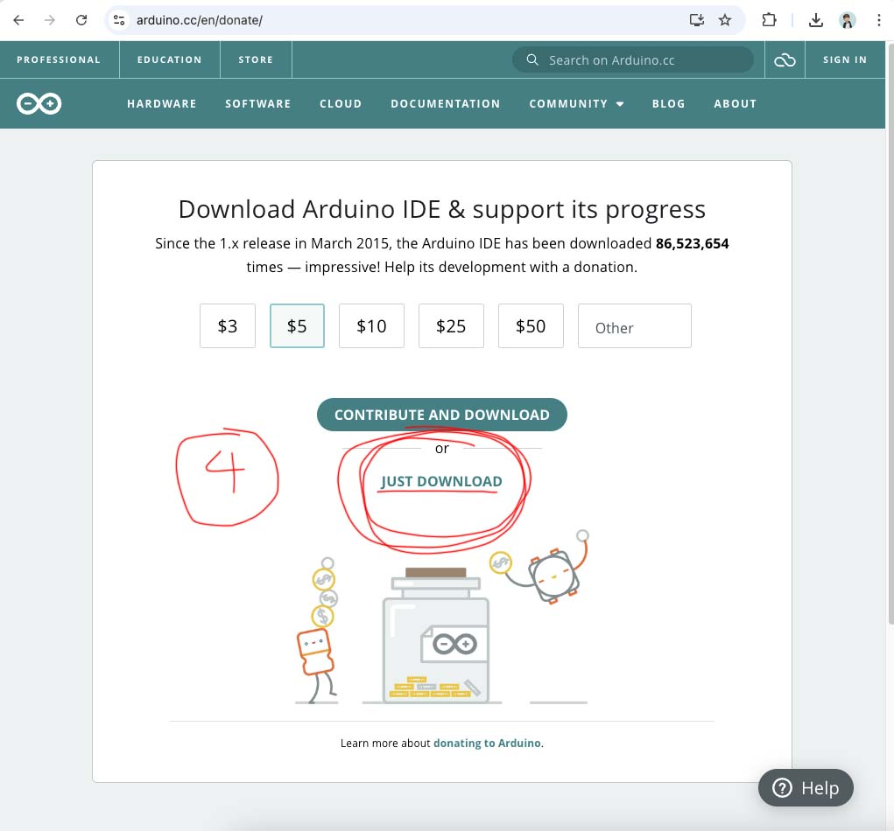

# Week 11 - Introduction to Microcontroller

## Today Topics

1. [Intro to Arduino-R4-WiFi](Arduino-R4-WiFi.md)
2. [LED Matrix](LED_Matrix.md)

## Today Exercises

1. [LED Matrix](LED_Matrix.md#exercise)

## How to install Arduino

Go to https://www.arduino.cc/en/software

เมื่อ Install เสร็จแล้วให้เปิดโปรแกรม Arduino ขึ้นมาและไปโหลด Board `Arduino UNO R4`

