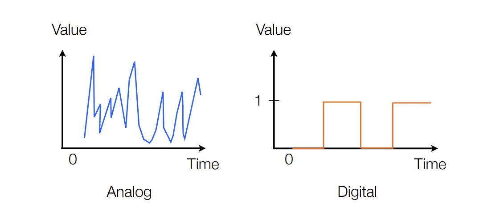
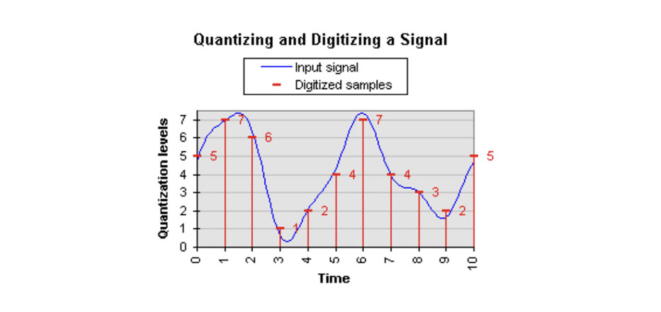
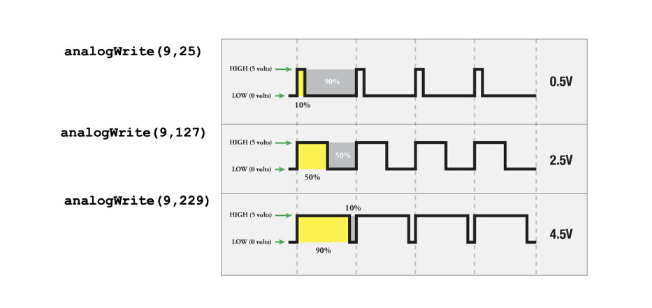
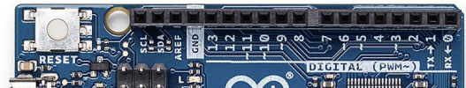
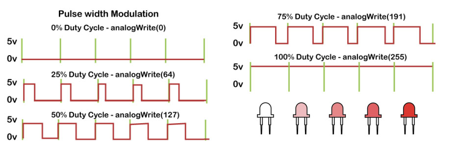
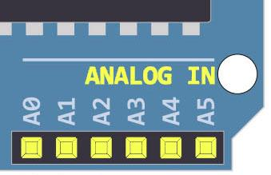
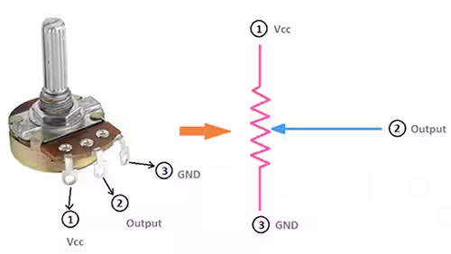
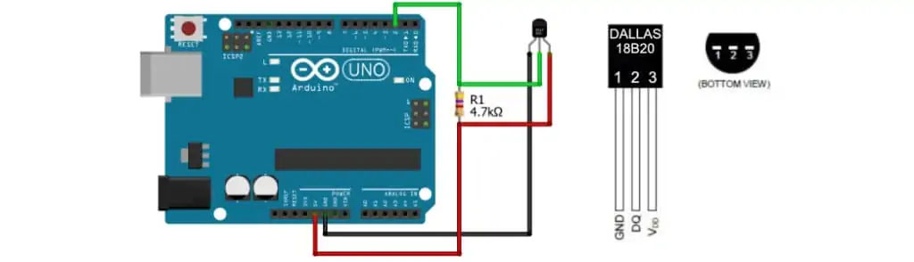

# Analog Signal

## The difference between Analog and Digital Signal

**สัญญาณอนาลอก (Analog Signal)** หมายถึงสัญญาณข้อมูลแบบต่อเนื่อง (Continuouse Data) มีขนาดของสัญญาณไม่คงที่
มีการเปลี่ยนแปลงขนาดของสัญญาณแบบค่อยเป็นค่อยไป มีลักษณะเป็นเส้นโค้งต่อเนื่องกันไป
โดยการส่งสัญญาณแบบอนาล็อกจะถูกรบกวนให้มีการแปลความหมายผิดพลาดได้ง่าย เช่น สัญญาณเสียงในสายโทรศัพท์ เป็นต้น

**สัญญาณดิจิตอล (Digital Signal)** หมายถึง สัญญาณที่เกี่ยวข้องกับข้อมูลแบบไม่ต่อเนื่อง(Discrete Data)
ที่มีขนาดแน่นอนซึ่งขนาดดังกล่าวอาจกระโดดไปมาระหว่างค่าสองค่า คือ สัญญาณระดับสูงสุดและสัญญาณระดับต่ำสุด
ซึ่งสัญญาณดิจิตอลนี้เป็นสัญญาณที่คอมพิวเตอร์ใช้ในการทำงานและติดต่อสื่อสารกันเป็นค่าของเลขลงตัว โดยปกติมักแทนด้วย
ระดับแรงดันที่แสดงสถานะเป็น "0" และ "1" หรืออาจจะมีหลายสถานะ ซึ่งจะกล่าวถึงในเรื่องระบบสื่อสารดิจิตอล มีค่าที่ตั้งไว้
(threshold) เป็นค่าบอกสถานะ ถ้าสูงเกินค่าที่ตั้งไว้สถานะเป็น "1" ถ้าต่ำกว่าค่าที่ตั้งไว้ สถานะเป็น "0"
ซึ่งมีข้อดีในการท่าให้เกิดความผิดพลาดน้อยลง

สัญญาณอนาลอก กับ สัญญาณดิจิตอล มีความแตกต่างกันทางความต่อเนื่องของสัญญาณและความแม่นยำของสัญญาณ




## การส่งสัญญาณ Analog และสัญญาณแบบ Digital

**สัญญาณแบบ Analog** จะเป็นสัญญาณแบบต่อเนื่องที่ทุกๆ ค่าเปลี่ยนแปลงไปของระดับสัญญาณจะมีความหมาย การส่งสัญญาณแบบ Analog
จะถูกรบกวนให้มีการแปลความหมายผิดพลาดได้ง่ายกว่า เนื่องจาก ค่าทุกค่าถูกนำมาใช้งานนั้นเอง
ซึ่งสัญญาณแบบอนาล็อกนี้จะเป็นสัญญาณที่สื่อกลาง ในการสื่อสาร ส่วนมากใช้อยู่ เช่น สัญญาณเสียงในสายโทรศัพท์ เป็นต้น

**สัญญาณแบบ Digital** จะประกอบขึ้นจากระดับสัญญาณเพียง 2 ค่า คือสัญญาณระดับสูงสุดและสัญญาระดับต่ำสุด
ดังนั้นจะมีประสิทธิภาพและ ความน่าเชื่อถือสูงกว่าแบบ Analog เนื่องจากมีการใช้งานเพียง 2 ค่าเพื่อน่ามาตีความหมายเป็น
On/Off หรือ 1/0 เท่านั้นซึ่งสัญญาณดิจิตอลนี้ จะเป็นสัญญาณที่คอมพิวเตอร์ใช้ในการทำงานและติดต่อสื่อสารกันในทางปฏิบัติ

## How To Use Arduino’s Analog and Digital Input/Output

สัญญาณอนาล็อกเป็นสัญญาณที่สามารถมีค่าได้หลากหลายจำนวน แตกต่างจากสัญญาณดิจิทัลที่มีค่าเพียงสองค่า: สูง (HIGH) และต่ำ
(LOW)

Arduino มีตัวแปลงอนาล็อกเป็นดิจิทัลในตัว (ADC) ซึ่งทำหน้าที่แปลงแรงดันอนาล็อกเป็นค่าดิจิทัล
ฟังก์ชันที่ใช้เพื่อรับค่าของสัญญาณอนาล็อกคือ `analogRead(pin)`
ฟังก์ชันนี้จะเปลี่ยนค่าของแรงดันที่อยู่บนขาอนาล็อกและส่งคืนเป็นค่าดิจิทัลตั้งแต่ 0 ถึง 1023 ซึ่งสัมพันธ์กับค่าการอ้างอิง
ค่าอ้างอิงเริ่มต้นคือ 5 V



Arduino ไม่มีตัวแปลงดิจิทัลเป็นอนาล็อกในตัว (DAC) แต่สามารถใช้การปรับความกว้างของพัลส์ (PWM)
สัญญาณดิจิทัลเพื่อให้ได้ฟังก์ชันบางอย่างที่เหมือนกับการส่งออกอนาล็อก ฟังก์ชันที่ใช้ในการส่งออกสัญญาณ PWM คือ
`analogWrite(pin, value)`



## การส่งค่า Analog Output ออก port (DAC)

Port DAC ของ Arduino จะมีเครื่องหมายตัวหนอน (tilde) `~` กำกับไว้อยู่

- ขำที่มีสัญลักษณ์ ~ ( 3,5,6,9,10,11)
  

ใช้่คำสั่ง `analogWrite(pin, value)`

- `pin`: the Arduino pin to write to. Allowed data types: int.
- `value`: the duty cycle: between 0 (always off) and 255 (always on). Allowed data types: int.

ฟังก์ชัน `analogWrite()` ใช้เพื่อส่งค่าอนาล็อก (PWM) ไปยังขา ซึ่งสามารถใช้เพื่อปรับความสว่างของ LED
หรือควบคุมความเร็วของมอเตอร์ได้ เมื่อเรียกใช้ `analogWrite()` ขานั้นจะสร้างสัญญาณสี่เหลี่ยมจัตุรัสที่มีรอบการทำงาน (
duty cycle) ตามที่กำหนด จนกว่าจะมีการเรียก `analogWrite()` อีกครั้ง (หรือตัวฟังก์ชัน `digitalRead()` หรือ
`digitalWrite()` บนขานั้น)
[More Details](https://www.arduino.cc/reference/en/language/functions/analog-io/analogwrite/)



### Examples

```cpp
// กำหนดพินของ DAC
const int DAC_PIN = 3;  // ใช้ 3 เป็นพิน DAC

void setup() {
  // ตั้งค่าพินเป็น OUTPUT
  pinMode(DAC_PIN, OUTPUT);
}

void loop() {
  // ส่งค่า Analog Output ตั้งแต่ 0 ถึง 255
  for (int value = 0; value <= 255; value++) {
    analogWrite(DAC_PIN, value); // ส่งค่าไปที่ DAC
    delay(50); // รอสักครู่เพื่อดูการเปลี่ยนแปลง
  }

  // ส่งค่าลดลงจาก 255 ถึง 0
  for (int value = 255; value >= 0; value--) {
    analogWrite(DAC_PIN, value); // ส่งค่าไปที่ DAC
    delay(50); // รอสักครู่เพื่อดูการเปลี่ยนแปลง
  }
}
```

## การอ่านค่า Analog Output จาก Port Analog

ใช้่คำสั่ง `analogRead(pin)`

- `pin`: the name of the analog input pin to read from.

ฟังก์ชัน `analogRead()` ใช้เพื่ออ่านค่าจากขาอ นาล็อกที่กำหนด บอร์ด Arduino มีตัวแปลงอนาล็อกเป็นดิจิตอล (ADC)
แบบหลายช่องทาง 10 บิต ซึ่งหมายความว่าจะทำการแปลงแรงดันไฟฟ้าจาก 0 ถึงแรงดันไฟฟ้าที่ใช้งาน (5V หรือ 3.3V)
เป็นค่าจำนวนเต็มระหว่าง 0 ถึง 1023 ในกรณีของ Arduino UNO ความละเอียดจะอยู่ที่ประมาณ 5 โวลต์ / 1024 หน่วย หรือประมาณ
0.0049 โวลต์ (4.9 mV) ต่อหน่วย โดยสามารถดูตารางของขาใช้งาน แรงดันไฟฟ้าที่ทำงาน และความละเอียดสูงสุดสำหรับบอร์ด Arduino
ต่าง ๆ ได้เพิ่มเติม [More Details](https://www.arduino.cc/reference/en/language/functions/analog-io/analogread/)

**สำคัญ:** เวลาจะอ่านค่า Analog ต้องใช้ Analog In Pin เท่านั้น



### Examples

```cpp
// กำหนดขา Analog ที่จะอ่านค่า
const int analogPin = A0; // ขา A0

void setup() {
    // เริ่มต้น Serial Communication
    Serial.begin(9600);
    pinMode(analogPin, INPUT);
}

void loop() {
    // อ่านค่า Analog
    int sensorValue = analogRead(analogPin);
    
    // แสดงผลค่าใน Serial Monitor
    Serial.print("Analog Value: ");
    Serial.println(sensorValue);
    
    // รอ 1 วินาทีก่อนอ่านค่าอีกครั้ง
    delay(1000);
}
```

## Exercise 4: Analog LED Fading

เลือกใช้ PWM Pin อื่นๆ เป็นจำนวน 2 Pin

- LED1 Fading จาก Off ไปยัง Full-Bright
- LED2 Fading จาก Off ไปยัง Full-Bright เร็วเป็นสองเท่าของ LED1

Hint: [Tinkercad](https://www.tinkercad.com/things/ePJssgTI8Vo-l24-led-fading?sharecode=mkqe5jc0w5rYart6cIyuni-O2BlwSVwE-Mn0FLg6ev8)

## Exercise 5: Analog Reading

ให้เขียนโปรแกรม Arduino เพื่อควบคุมความสว่างของ LED โดยใช้ Potentiometer เพื่อปรับค่าความสว่าง LED
ให้มีการเปลี่ยนแปลงตามค่าที่ Potentiometer ปรับ

Hint: [Tinkercad](https://www.tinkercad.com/things/ga6pNRFHVXI-l25-analog-reading?sharecode=kZHN-vveGuvqCZl4ss-zFi1ZmuD0M5KhiZzZYMhNxIc)



## Exercise 6: Temperature Sensor

ต่อวงจร Sensor อุณหภูมิ และเขียนโปรแกรมแสดงค่าอุณหภูมิที่วัดได้บน Serial Monitor

Hint: [Tinkercad](https://www.tinkercad.com/things/2OZqp7WO6Td-l26-temperature-sensor?sharecode=s-GGIAwVG3TqRgbwbsAaloo0osO_byVMoD4b76Ax77c)



### วิธีการใช้ Serial Monitor

การใช้ Serial Monitor ใน Arduino เป็นวิธีที่สะดวกในการตรวจสอบข้อมูลและการสื่อสารระหว่างบอร์ดกับคอมพิวเตอร์

เขียนโค้ดสำหรับการส่งข้อมูลไปยัง Serial Monitor โดยใช้คำสั่ง `Serial.begin()`, `Serial.print()`, หรือ
`Serial.println()` ตัวอย่างโค้ด:

```cpp
void setup() {
    Serial.begin(9600); // เริ่มต้นการสื่อสารที่อัตรา 9600 bps
}

void loop() {
    Serial.println("Hello, Arduino!"); // ส่งข้อความไปยัง Serial Monitor
    delay(1000); // รอ 1 วินาทีก่อนส่งข้อความอีกครั้ง
}
```

**เปิด Serial Monitor**: คลิกที่ปุ่ม Serial Monitor (ไอคอนที่มีรูปหน้าจอ) หรือไปที่ Tools > Serial Monitor เพื่อเปิด
Serial
Monitor

**ตั้งค่าอัตราบิต**: ตรวจสอบให้แน่ใจว่าอัตราบิตใน Serial Monitor ตรงกับอัตราที่คุณตั้งใน Serial.begin()
(ในตัวอย่างคือ 9600)

## Reference

- https://scimath.org/article-physics/item/4819-analog-digital
- [How To Use Arduino’s Analog and Digital Input/Output](https://www.allaboutcircuits.com/projects/using-the-arduinos-analog-io/#:~:text=as%20digital%20signals.-,The%20Arduino%20can%20input%20and%20output%20analog%20signals%20as%20well,%2Ddigital%20converter%20(ADC).)
