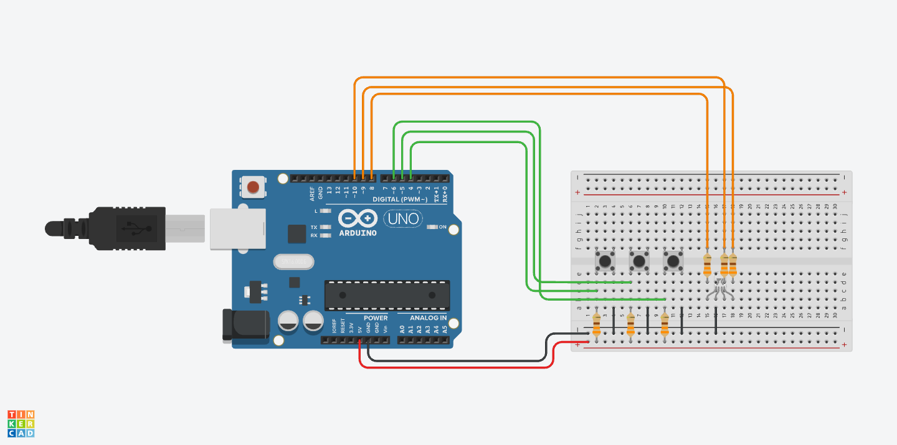

# Week 12 - Digital To Analog

## Today Topics

1. [...]()

## Today Exercises

**เข็คส่งงาน:** https://bit.ly/PhyCom2024Score

| ข้อ                        | รายละเอียด                                                                                                                                                                                                                                                                                                                                                                                                                    | ตัวอย่าง                        |
|----------------------------|-------------------------------------------------------------------------------------------------------------------------------------------------------------------------------------------------------------------------------------------------------------------------------------------------------------------------------------------------------------------------------------------------------------------------------|---------------------------------|
| **1. Digital Input:**      | ให้ใช้ Switch กับ LED  - เมื่อกด Switch แล้วไฟ LED จะเปลี่ยนสถานะ (เปิดไปปิด, ปิดไปเปิด)     **Tinkercad:**   - [Pull Up](https://www.tinkercad.com/things/eIF9FVqnx7H-l21-led-and-switch-pull-up?sharecode=yhk6NOJbJE11-tuehxgdLl0NhvozczwZtV4gJVTSrAc)   - [Pull Down](https://www.tinkercad.com/things/bk5DzidrknQ-l21-led-and-switch-pull-down?sharecode=ABUz4OiP6ag6g5-p-S4vjg-RUZhOdgmLqYdeUVlPG7A) |  |
| **2. Color LED Switch:**   | ต่อ Switch จำนวน 3 ตัว เมื่อกด switch แต่ละตัว ให้ Color LED ติดคนละสีเช่น Red, Green , Blue และเมื่อปล่อย switch ให้ Color LED ดับ      **Hint:** [Tinkercad](https://www.tinkercad.com/things/2XUCW6PST9y-l22-rgb-switch-pull-up?sharecode=MbJjTXbM3f66N94bDamYrwzpsqfuQTjNNado4DRArE0)   - ใน Tinkercad เป็น Common Cathode ถ้าต่อจริงให้เปลี่ยนเป็น Common Anode ด้วย                                         |  |
| **3. Keypad (RGB):**       | จงเขียนโปรแกรมรับค่าจาก Keypad โดยให้แสดงสี ของ Color LED เป็นสีต่างๆ ตามปุ่มที่กด โดยกำหนดสีเองตามใจชอบ      **Hint:**  [Tinkercad](https://www.tinkercad.com/things/5V1IjUqJYdu-l23-keypad-rgb-?sharecode=GzvC586NXedQfWTk0Wt0mGwC74el3gEQ-jayZpwLrdw)                                                                                                                                                              |  | 
| **4. Analog LED Fading:**  | เลือกใช้ PWM Pin อื่นๆ เป็นจำนวน 2 Pin  - **LED1** Fading จาก Off ไปยัง Full-Bright   - **LED2** Fading จาก Off ไปยัง Full-Bright เร็วเป็นสองเท่าของ LED1     - **Hint:** [Tinkercad](https://www.tinkercad.com/things/ePJssgTI8Vo-l24-led-fading?sharecode=mkqe5jc0w5rYart6cIyuni-O2BlwSVwE-Mn0FLg6ev8)                                                                                                      |  | 
| **5. Analog Reading:**     | ให้เขียนโปรแกรม Arduino เพื่อควบคุมความสว่างของ LED โดยใช้ Potentiometer เพื่อปรับค่าความสว่าง LED ให้มีการเปลี่ยนแปลงตามค่าที่ Potentiometer ปรับ     - **Hint:** [Tinkercad](https://www.tinkercad.com/things/ga6pNRFHVXI-l25-analog-reading?sharecode=kZHN-vveGuvqCZl4ss-zFi1ZmuD0M5KhiZzZYMhNxIc)                                                                                                                 |  | 
| **6. Temperature Sensor:** | ต่อวงจร Sensor อุณหภูมิ และเขียนโปรแกรมแสดงค่าอุณหภูมิที่วัดได้บน Serial Monitor     - **Hint:** [Tinkercad](https://www.tinkercad.com/things/2OZqp7WO6Td-l26-temperature-sensor?sharecode=s-GGIAwVG3TqRgbwbsAaloo0osO_byVMoD4b76Ax77c)                                                                                                                                                                               |  | 

