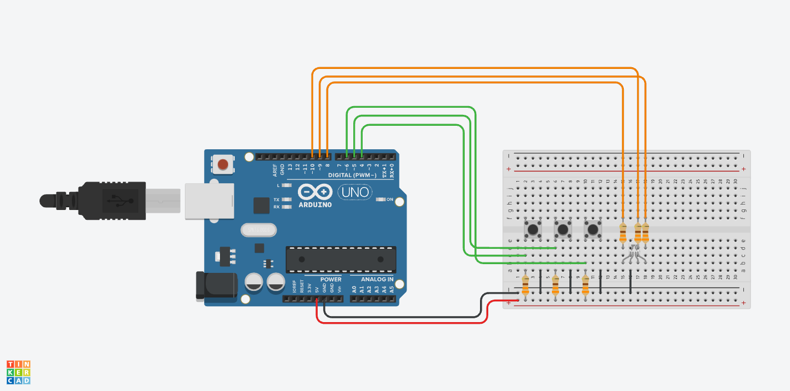

# Week 13 - Digital To Analog

## Today Topics

1. [Input Button](01.Input.md)

## Today Exercises

**เข็คส่งงาน:** https://bit.ly/PhyCom2025Score

| ข้อ                      | รายละเอียด                                                                                                                                                                                                                                                                                                                                                                                                                    | ตัวอย่าง                        |
|--------------------------|-------------------------------------------------------------------------------------------------------------------------------------------------------------------------------------------------------------------------------------------------------------------------------------------------------------------------------------------------------------------------------------------------------------------------------|---------------------------------|
| **1. Color LED Switch:** | ต่อ Switch จำนวน 3 ตัว เมื่อกด switch แต่ละตัว ให้ Color LED ติดคนละสีเช่น Red, Green , Blue และเมื่อปล่อย switch ให้ Color LED ดับ      **Hint:** [Tinkercad](https://www.tinkercad.com/things/2XUCW6PST9y-l22-rgb-switch-pull-up?sharecode=MbJjTXbM3f66N94bDamYrwzpsqfuQTjNNado4DRArE0)   - ใน Tinkercad เป็น Common Cathode ถ้าต่อจริงให้เปลี่ยนเป็น Common Anode ด้วย                                         |  |

สไลด์ Lecture: [PC67-12_Micro02.pdf](files/PC67-12_Micro02.pdf)

