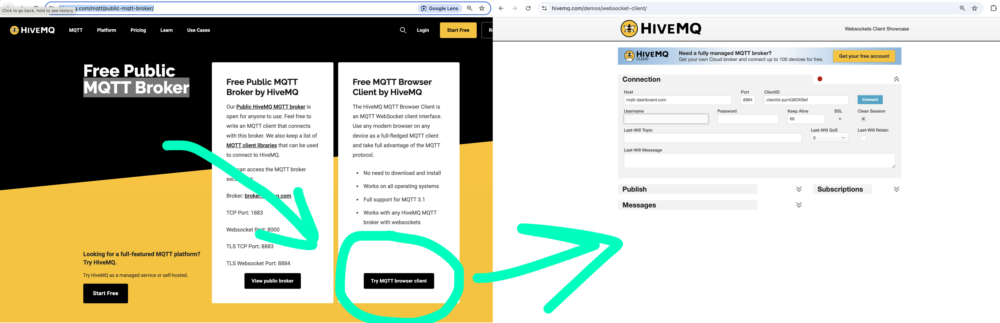

# 1. MQTT Broker

https://www.hivemq.com/mqtt/public-mqtt-broker/

## Step 1: Connection

- **Host**: `mqtt-dashboard.com`
- **Port**: `8884`
- **Client ID**: ห้ามซ้ำกันเด็ดขาด

เสร็จแล้วกด Connect ถ้าสำเร็จจะขึ้นสถานะว่า Connected

## Step 2: Subscribe The Topic

กรอกหัวข้อที่ต้องการติดตามแล้วกดปุ่ม Subscribe

- **Topic**: `itkmitl/phycom`

## Step 3: Publish

ในฟิลด์ "Publish" จะสามารถกรอกหัวข้อที่ต้องการส่งข้อความไป (เช่น test/topic) และข้อความที่ต้องการส่ง
