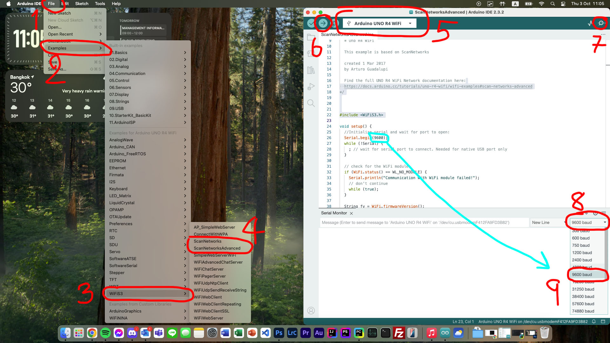
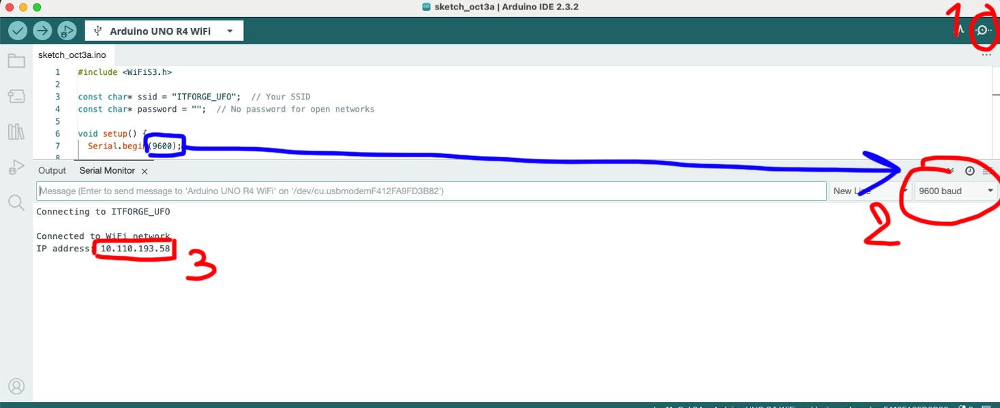
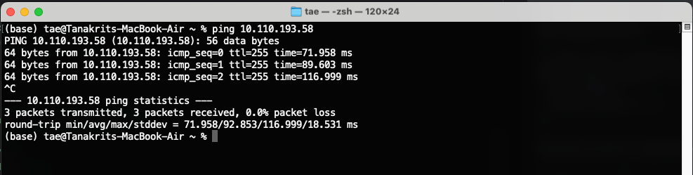
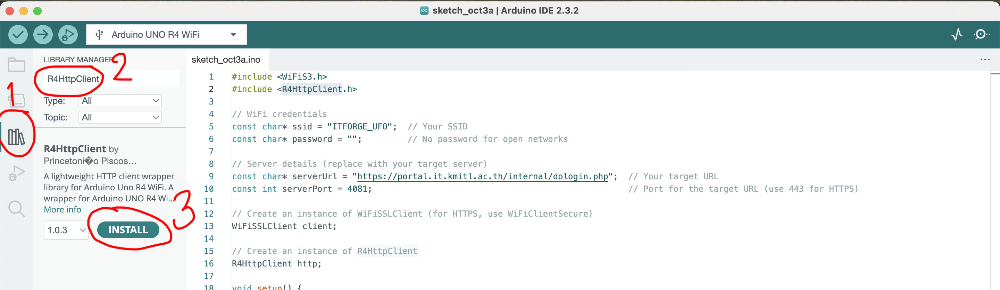
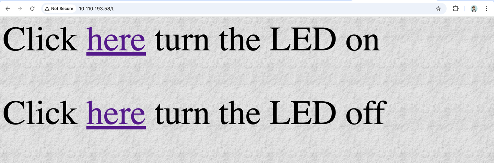

# 1. Connect To WiFi

https://docs.arduino.cc/tutorials/uno-r4-wifi/wifi-examples/

Arduino UNO R4 WiFi มาพร้อมกับโมดูล ESP32-S3 ที่ช่วยให้คุณเชื่อมต่อกับเครือข่าย Wi-Fi® และทำงานด้านเครือข่ายได้
รองรับโปรโตคอลต่าง ๆ เช่น HTTPS, MQTT, UDP ซึ่งได้รับการทดสอบและยืนยันว่าทำงานได้ดี

การเชื่อมต่อ Wi-Fi® สามารถทำได้ผ่านไลบรารี WiFiS3 ที่ติดตั้งมาพร้อมกับ Arduino UNO R4 Board Package เมื่อคุณติดตั้ง
Board Package ไลบรารี WiFiS3 จะถูกติดตั้งโดยอัตโนมัติ

# Scan Networks

สามารถใช้ Code ตัวอย่างของ Library `WiFiS3.h` ได้เลย

** ถ้าไม่ขึ้นให้ลง Library ของบอร์ด Arduino R4 WiFi ก่อน (ปิดแล้วเปิดใหม่ด้วย)



# Connect to ITFORGE_UFO

**Full Code Here:** [connect to UFO.ino](files/wifi/connect%20to%20UFO.ino)

1. **เรียกใช้ Library WiFiS3**
   `#include <WiFiS3.h>`

2. **กำหนด SSID และรหัสผ่าน**

    ``` cpp
    const char* ssid = "ITFORGE_UFO";
    const char* password = ""; 
    ```
   ITFORGE_UFO เป็น open network เลยไม่ต้องมีรหัสผ่าน
3. **เชื่อมต่อกับ Wi-Fi**
   เรียกใช้เพื่อเริ่มการเชื่อมต่อกับเครือข่าย Wi-Fi ที่กำหนด
    1. กรณีที่ไม่มีรหัสผ่าน
         ``` cpp
         WiFi.begin(ssid);
         ```
    2. กรณีที่มีรหัสผ่าน
         ``` cpp
         WiFi.begin(ssid, password);
         ```
4. **รอการเชื่อมต่อ** ลูปนี้ตรวจสอบสถานะการเชื่อมต่อซ้ำไปเรื่อยๆ
    ``` cpp
    while (WiFi.status() != WL_CONNECTED) {
      delay(500);
      Serial.print(".");
    }
    ```
5. **ข้อความยืนยันการเชื่อมต่อ** เมื่อเชื่อมต่อสำเร็จ จะแสดงข้อความยืนยันและที่อยู่ IP ของอุปกรณ์ใน Serial Monitor
   โดยใช้ `WiFi.localIP()` เพื่อดึงที่อยู่ IP ท้องถิ่นที่กำหนดให้กับอุปกรณ์โดยเครือข่าย Wi-Fi
    ``` cpp
    Serial.println("\nConnected to WiFi network");
    Serial.print("IP address: ");
    Serial.println(WiFi.localIP());
    ```

ถ้าไม่ขึ้นใน Serial Monitor ให้ปรับ baud rate และลองกดปุ่ม reset บนบอร์ด Arduino



ถ้าเชื่อมสำเร็จให้ลองเปิด Terminal ขึ้นมาแล้วลอง Ping ไปดู

```bash
ping 10.0.15.29
```



# Login to Kerio

**Full Code Here:** [Login to Kerio.ino](files/wifi/LogintoKerio.ino)

โค้ดนี้ใช้สำหรับเชื่อมต่อไมโครคอนโทรลเลอร์ (เช่น ESP32) กับเครือข่าย Wi-Fi และส่งคำขอ HTTP POST
ไปยังเซิร์ฟเวอร์ผ่านการเชื่อมต่อ HTTPS เพื่อที่จะใช้ Login Network ของคณะ

- Shell Script เอาไว้ Login Network คณะ: [login.sh](files/wifi/login.sh)
- Batch Script เอาไว้ Login Network คณะ: [login.bat](files/wifi/login.bat)
- https://portal.it.kmitl.ac.th:4081/login/

ให้ไปโหลด Library ชื่อ `R4HttpClient` ก่อน



# Open Web Server With Arduino

**Full Code Here:** [open_webserver.ino](files/wifi/open_webserver.ino)



