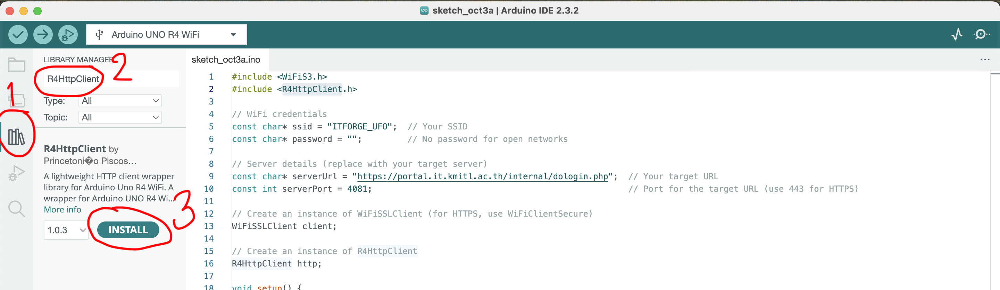
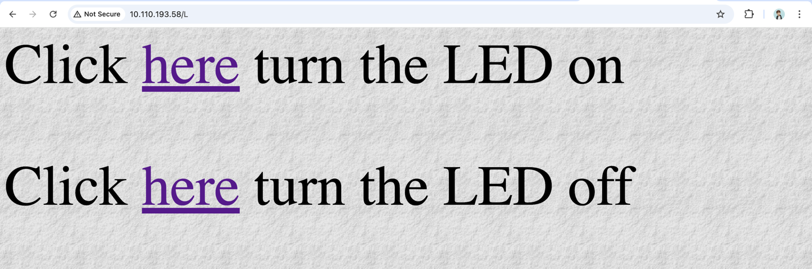

# 1. Connect To WiFi

https://docs.arduino.cc/tutorials/uno-r4-wifi/wifi-examples/

Arduino UNO R4 WiFi มาพร้อมกับโมดูล ESP32-S3 ที่ช่วยให้คุณเชื่อมต่อกับเครือข่าย Wi-Fi® และทำงานด้านเครือข่ายได้
รองรับโปรโตคอลต่าง ๆ เช่น HTTPS, MQTT, UDP ซึ่งได้รับการทดสอบและยืนยันว่าทำงานได้ดี

การเชื่อมต่อ Wi-Fi® สามารถทำได้ผ่านไลบรารี WiFiS3 ที่ติดตั้งมาพร้อมกับ Arduino UNO R4 Board Package เมื่อคุณติดตั้ง
Board Package ไลบรารี WiFiS3 จะถูกติดตั้งโดยอัตโนมัติ

# Scan Networks

สามารถใช้ Code ตัวอย่างของ Library `WiFiS3.h` ได้เลย


# Connect to ITFORGE_UFO

```cpp
#include <WiFiS3.h>

const char* ssid = "ITFORGE_UFO";  // Your SSID
const char* password = "";  // No password for open networks

void setup() {
  Serial.begin(9600);

  // Connect to the Wi-Fi network
  Serial.print("Connecting to ");
  Serial.println(ssid);

  // Since there’s no password, pass only the SSID
  WiFi.begin(ssid);

  // Wait until connected
  while (WiFi.status() != WL_CONNECTED) {
    delay(500);
    Serial.print(".");
  }

  Serial.println("\nConnected to WiFi network");
  
  // Print the IP address
  Serial.print("IP address: ");
  Serial.println(WiFi.localIP());
}

void loop() {
  // Your code here (e.g., handling communication)
}
```


ถ้าเชื่อมสำเร็จให้ลองเปิด Terminal ขึ้นมาแล้วลอง Ping ไปดู

```bash
ping 10.0.15.29
```


# Login to Kerio

- Shell Script เอาไว้ Login Network คณะ: [login.sh](files/login.sh)
- Batch Script เอาไว้ Login Network คณะ: [login.bat](files/login.bat)
- https://portal.it.kmitl.ac.th:4081/login/



```cpp
#include <WiFiS3.h>
#include <R4HttpClient.h>

// WiFi credentials
const char* ssid = "ITFORGE_UFO";  // Your SSID
const char* password = "";         // No password for open networks

// Server details (replace with your target server)
const char* serverUrl = "https://portal.it.kmitl.ac.th/internal/dologin.php";  // Your target URL
const int serverPort = 4081;                                                         // Port for the target URL (use 443 for HTTPS)

// Create an instance of WiFiSSLClient (for HTTPS, use WiFiClientSecure)
WiFiSSLClient client;

// Create an instance of R4HttpClient
R4HttpClient http;

void setup() {
  Serial.begin(9600);

  // Connect to Wi-Fi
  connectToWiFi();

  // Initialize the R4HttpClient with the client and server details
  http.begin(client, serverUrl, serverPort);
}

void loop() {
  // Example POST request
  String payload = "kerio_username=maxhub+peer+tutor2&kerio_password=";  // Your POST data
  int responseCode = http.POST(payload);

  if (responseCode > 0) {
    Serial.print("HTTP Response code: ");
    Serial.println(responseCode);
    String responseBody = http.getBody();
    Serial.println(responseBody);
  } else {
    Serial.print("Error making POST request: ");
    Serial.println(responseCode);  // Print the actual error code
  }


  http.close();  // Close the connection
  delay(5000);   // Wait for 5 seconds before next request
}

// Function to connect to your WiFi network
void connectToWiFi() {
  Serial.print("Connecting to ");
  Serial.println(ssid);

  // Since there’s no password, pass only the SSID
  WiFi.begin(ssid);

  // Wait until connected
  while (WiFi.status() != WL_CONNECTED) {
    delay(500);
    Serial.print(".");
  }

  Serial.println("\nConnected to WiFi network");

  // Print the IP address
  Serial.print("IP address: ");
  Serial.println(WiFi.localIP());
}
```

# Open Web Server



[open_webserver.ino](files/open_webserver.ino)