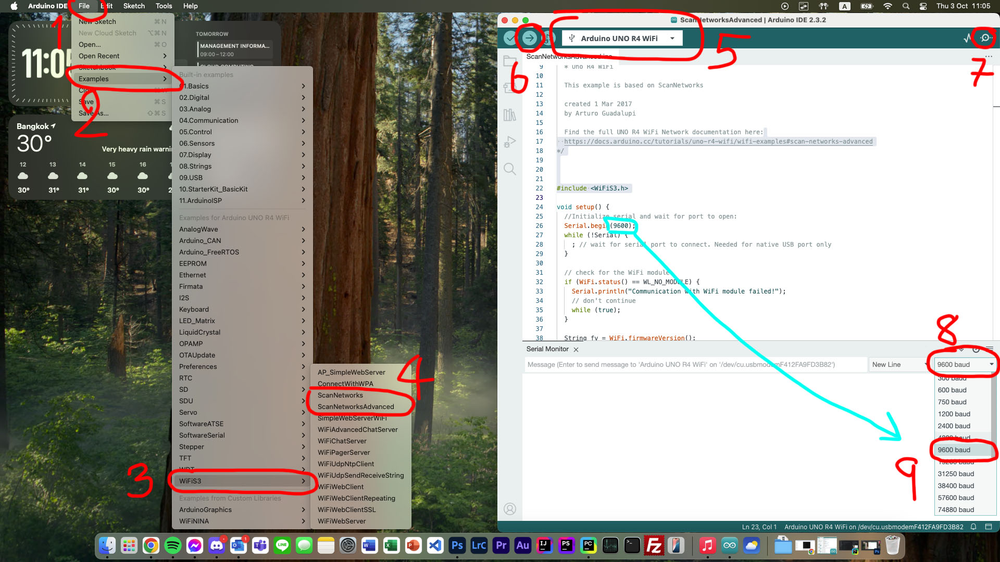
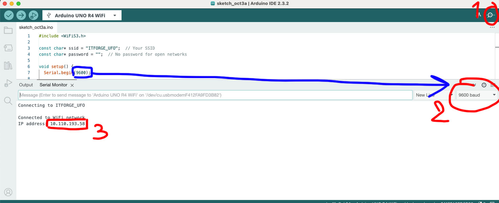
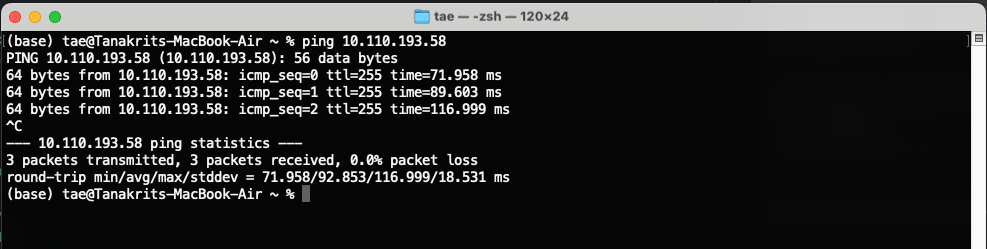

# 1. Connect To WiFi

https://docs.arduino.cc/tutorials/uno-r4-wifi/wifi-examples/

Arduino UNO R4 WiFi มาพร้อมกับโมดูล ESP32-S3 ที่ช่วยให้คุณเชื่อมต่อกับเครือข่าย Wi-Fi® และทำงานด้านเครือข่ายได้
รองรับโปรโตคอลต่าง ๆ เช่น HTTPS, MQTT, UDP ซึ่งได้รับการทดสอบและยืนยันว่าทำงานได้ดี

การเชื่อมต่อ Wi-Fi® สามารถทำได้ผ่านไลบรารี WiFiS3 ที่ติดตั้งมาพร้อมกับ Arduino UNO R4 Board Package เมื่อคุณติดตั้ง
Board Package ไลบรารี WiFiS3 จะถูกติดตั้งโดยอัตโนมัติ

## Scan Networks

สามารถใช้ Code ตัวอย่างของ Library `WiFiS3.h` ได้เลย



## Connect to ITFORGE_UFO

```cpp
#include <WiFiS3.h>

const char* ssid = "ITFORGE_UFO";  // Your SSID
const char* password = "";  // No password for open networks

void setup() {
  Serial.begin(9600);

  // Connect to the Wi-Fi network
  Serial.print("Connecting to ");
  Serial.println(ssid);

  // Since there’s no password, pass only the SSID
  WiFi.begin(ssid);

  // Wait until connected
  while (WiFi.status() != WL_CONNECTED) {
    delay(500);
    Serial.print(".");
  }

  Serial.println("\nConnected to WiFi network");
  
  // Print the IP address
  Serial.print("IP address: ");
  Serial.println(WiFi.localIP());
}

void loop() {
  // Your code here (e.g., handling communication)
}
```



ถ้าเชื่อมสำเร็จให้ลองเปิด Terminal ขึ้นมาแล้วลอง Ping ไปดู

```bash
ping 10.0.15.29
```



## Login to Kerio

- Shell Script เอาไว้ Login Network คณะ: [login.sh](files/login.sh)
- Batch Script เอาไว้ Login Network คณะ: [login.bat](files/login.bat)
- https://portal.it.kmitl.ac.th:4081/login/


```cpp
#include <WiFiS3.h>
#include <R4HttpClient.h>

// WiFi credentials
const char* ssid = "ITFORGE_UFO";  // Your SSID
const char* password = "";         // No password for open networks

// Server details (replace with your target server)
const char* serverUrl = "https://portal.it.kmitl.ac.th/internal/dologin.php";  // Your target URL
const int serverPort = 4081;                                                         // Port for the target URL (use 443 for HTTPS)

// Create an instance of WiFiSSLClient (for HTTPS, use WiFiClientSecure)
WiFiSSLClient client;

// Create an instance of R4HttpClient
R4HttpClient http;

void setup() {
  Serial.begin(9600);

  // Connect to Wi-Fi
  connectToWiFi();

  // Initialize the R4HttpClient with the client and server details
  http.begin(client, serverUrl, serverPort);
}

void loop() {
  // Example POST request
  String payload = "kerio_username=maxhub+peer+tutor2&kerio_password=";  // Your POST data
  int responseCode = http.POST(payload);

  if (responseCode > 0) {
    Serial.print("HTTP Response code: ");
    Serial.println(responseCode);
    String responseBody = http.getBody();
    Serial.println(responseBody);
  } else {
    Serial.print("Error making POST request: ");
    Serial.println(responseCode);  // Print the actual error code
  }


  http.close();  // Close the connection
  delay(5000);   // Wait for 5 seconds before next request
}

// Function to connect to your WiFi network
void connectToWiFi() {
  Serial.print("Connecting to ");
  Serial.println(ssid);

  // Since there’s no password, pass only the SSID
  WiFi.begin(ssid);

  // Wait until connected
  while (WiFi.status() != WL_CONNECTED) {
    delay(500);
    Serial.print(".");
  }

  Serial.println("\nConnected to WiFi network");

  // Print the IP address
  Serial.print("IP address: ");
  Serial.println(WiFi.localIP());
}
```

## Open Web Server

```cpp
#include <WiFiS3.h>
#include <R4HttpClient.h>
#include "Arduino_LED_Matrix.h"

ArduinoLEDMatrix matrix;
uint32_t frame_off[3] = { 0, 0, 0 };

// WiFi credentials
const char* ssid = "ITFORGE_UFO";  // Your SSID
const char* password = "";         // No password for open networks

// Server details (replace with your target server)
const char* serverUrl = "https://portal.it.kmitl.ac.th/internal/dologin.php";  // Your target URL
const int serverPort = 4081;                                                   // Port for the target URL (use 443 for HTTPS)

// Create an instance of WiFiSSLClient (for HTTPS, use WiFiClientSecure)
WiFiSSLClient client;

// Create an instance of R4HttpClient
R4HttpClient http;

int led = LED_BUILTIN;
int status = WL_IDLE_STATUS;
WiFiServer server(80);

void setup() {
  Serial.begin(9600);

  // Connect to Wi-Fi
  connectToWiFi();

  // Initialize the R4HttpClient with the client and server details
  http.begin(client, serverUrl, serverPort);
  login_kerio();

  server.begin();

  matrix.begin();
}

void loop() {
  WiFiClient client = server.available();  // listen for incoming clients

  if (client) {                    // if you get a client,
    Serial.println("new client");  // print a message out the serial port
    String currentLine = "";       // make a String to hold incoming data from the client
    while (client.connected()) {   // loop while the client's connected
      if (client.available()) {    // if there's bytes to read from the client,
        char c = client.read();    // read a byte, then
        Serial.write(c);           // print it out to the serial monitor
        if (c == '\n') {           // if the byte is a newline character

          // if the current line is blank, you got two newline characters in a row.
          // that's the end of the client HTTP request, so send a response:
          if (currentLine.length() == 0) {
            // HTTP headers always start with a response code (e.g. HTTP/1.1 200 OK)
            // and a content-type so the client knows what's coming, then a blank line:
            client.println("HTTP/1.1 200 OK");
            client.println("Content-type:text/html");
            client.println();

            // the content of the HTTP response follows the header:
            client.print("<body background='https://www.it.kmitl.ac.th/~pattarachai/PIC/BG/stone.gif'>");
            client.print("<p style=\"font-size:7vw;\">Click <a href=\"/H\">here</a> turn the LED on<br></p>");
            client.print("<p style=\"font-size:7vw;\">Click <a href=\"/L\">here</a> turn the LED off<br></p>");
            client.print("<div align='right'><br>arduinoit.kmitl.ac.th<br>Any problem with downloading, feel free to contact me.</div>");
            client.print("</body>");

            // The HTTP response ends with another blank line:
            client.println();
            // break out of the while loop:
            break;
          } else {  // if you got a newline, then clear currentLine:
            currentLine = "";
          }
        } else if (c != '\r') {  // if you got anything else but a carriage return character,
          currentLine += c;      // add it to the end of the currentLine
        }

        // Check to see if the client request was "GET /H" or "GET /L":
        if (currentLine.endsWith("GET /H")) {
          digitalWrite(LED_BUILTIN, HIGH);  // GET /H turns the LED on
          matrix.loadFrame(LEDMATRIX_EMOJI_HAPPY);
        }
        if (currentLine.endsWith("GET /L")) {
          digitalWrite(LED_BUILTIN, LOW);  // GET /L turns the LED off
          matrix.loadFrame(frame_off);
        }
      }
    }
    // close the connection:
    client.stop();
    Serial.println("client disconnected");
  }
}

// Function to connect to your WiFi network
void connectToWiFi() {
  Serial.print("Connecting to ");
  Serial.println(ssid);

  // Since there’s no password, pass only the SSID
  WiFi.begin(ssid);

  // Wait until connected
  while (WiFi.status() != WL_CONNECTED) {
    delay(500);
    Serial.print(".");
  }

  Serial.println("\nConnected to WiFi network");

  // Print the IP address
  Serial.print("IP address: ");
  Serial.println(WiFi.localIP());
}

void login_kerio() {
  // Example POST request
  String payload = "kerio_username=maxhub+peer+tutor2&kerio_password=";  // Your POST data
  int responseCode = http.POST(payload);

  if (responseCode > 0) {
    Serial.print("HTTP Response code: ");
    Serial.println(responseCode);
    String responseBody = http.getBody();
    Serial.println(responseBody);
  } else {
    Serial.print("Error making POST request: ");
    Serial.println(responseCode);  // Print the actual error code
  }


  http.close();  // Close the connection
}

```