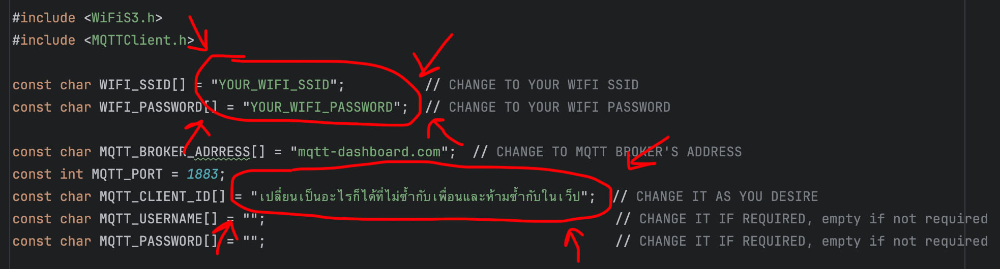
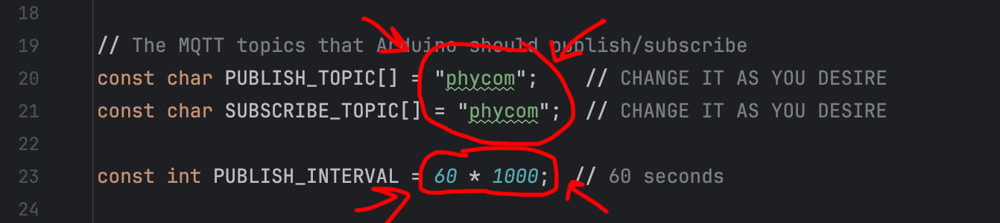

# Arduino with MQTT

การทดลองต่อ Arduino R4 WiFi กับ Public MQTT Broker

## 1. ติดตั้ง Library

ค้นหา `MQTT` จากนั้นกด Install

## 2. Code Section

[//]: # (- **ITFORGE_UFO**: [mqtt.ino]&#40;files/mqtt/mqtt.ino&#41;)

- **เน็ตตัวเอง/เน็ตบ้านปกติ**: [mqtt_original.ino](files/mqtt/mqtt_original.ino)

### เน็ตตัวเอง/เน็ตบ้านปกติ

ให้ไปแก้ Credentials ด้วย

## 3. Enter the topic you want to publish or subscribe to

ให้มาแก้ไขหัวข้อหรือ Topic ที่ต้องการจะ Publish กับ Subscribe ในโค้ดด้วย

- ถ้าในห้องแลปให้ใช้หัวข้อว่า `phycom`
- ถ้าใช้ทำ Lab Exercise ให้ใช้ `phycom/<your_student_id>`
