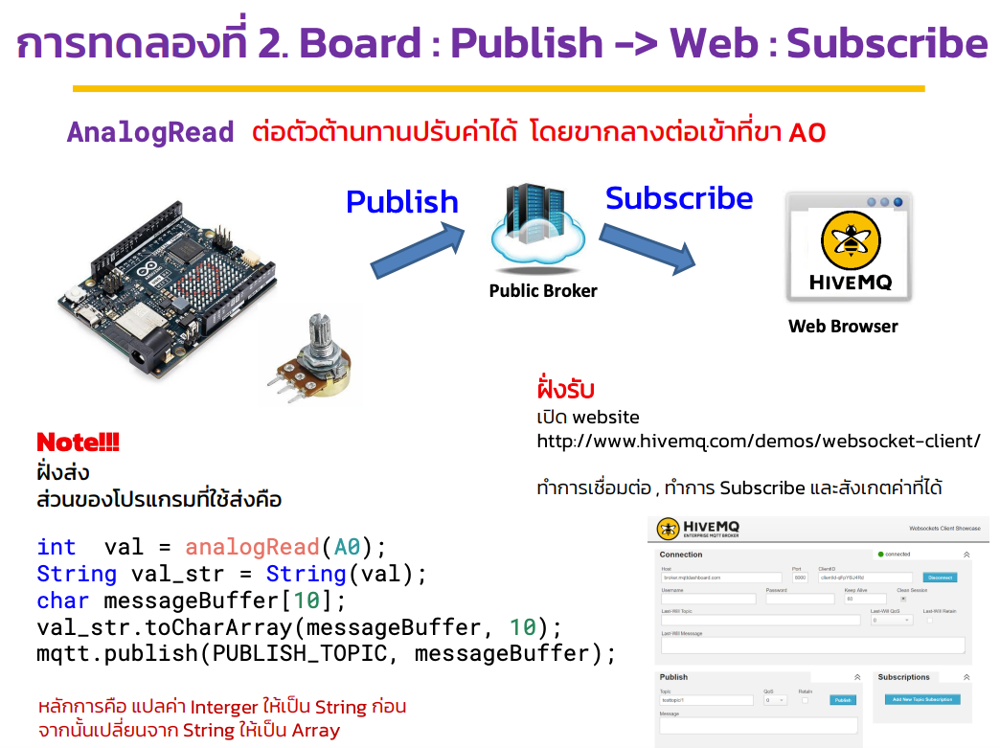
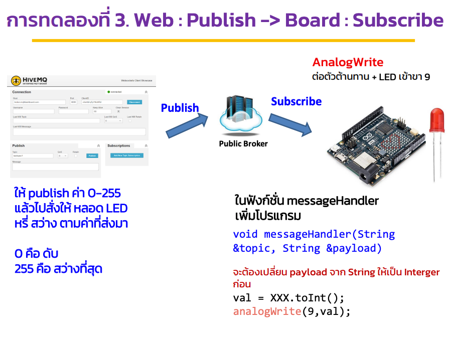
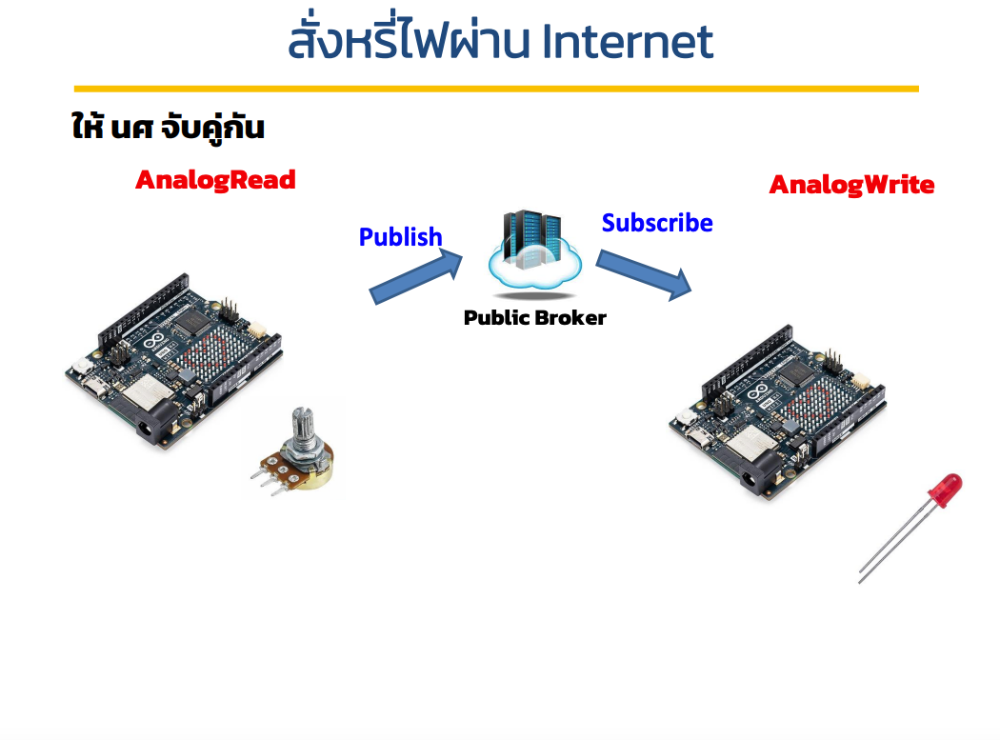

# Week 12 - Digital To Analog

## Today Topics

1. [MQTT Broker](01.MQTT%20Broker.md)
2. [Connect to ITKMITL WiFi](02.Connect%20To%20ITKMITL%20WiFi.md)
3. [Connect to Personal WiFi](03.Connect%20to%20Personal%20WiFi.md)
4. [Arduino With MQTT.md](04.Arduino%20With%20MQTT.md)

## Today Exercises

**เข็คส่งงาน:** https://bit.ly/PhyCom2024Score

| ข้อ                        | รายละเอียด                                                                                                                                                                                                                                                                                                                                | ตัวอย่าง                                                                                         |
|----------------------------|-------------------------------------------------------------------------------------------------------------------------------------------------------------------------------------------------------------------------------------------------------------------------------------------------------------------------------------------|--------------------------------------------------------------------------------------------------|
| **1. Web Server:**         | ให้นำโค้ดนี้ไปรันและเปิด Web Server ผ่านตัว Arduino ให้ได้                                                                                                                                                                                                                                                                                | [Open Web Server With Arduino](02.Connect%20To%20ITKMITL%20WiFi.md#open-web-server-with-arduino) |
| **2. MQTT Potentiometer:** | ต่อตัวต้านทานปรับค่าได้และส่งค่าของตัวต้านทานไปที่ HiveMQ                                                                                                                                                                                                                                                                                 |                                                                     |
| **3. MQTT LED:**           | ให้ publish ค่า 0-255 แล้วไปสั่งให้หลอด LED หรี่, สว่างค่าที่ส่งมา     - 0 คือดับ   - 255 คือสว่างสุด     ในฟังก์ชั่น messageHandler เพิ่มโปรแกรม `void messageHandler(String &topic, String &payload)` จะต้องเปลี่ยน payload จาก String ให้เป็น Interger ก่อน     `val = XXX.toInt();` `analogWrite(9,val);` |                                                                     |
| **4. MQTT Pair:**          | ให้นศ จับคู่กัน - คนส่งส่งค่าจาก Potentiometer   - คนรับนำค่าไปสั่งให้หลอด LED หรี่เหมือนข้อที่ 3                                                                                                                                                                                                                                 |                                                                     |
| **5. Feedback Form:**      | ให้ประเมินวิขา Physical Computing และ TA   https://forms.office.com/r/PrFUWGzfVu                                                                                                                                                                                                                                                      |                                                                     |

สไลด์ Lecture: [PC67-15_Micro03.pdf](files/PC67-15_Micro03.pdf)

